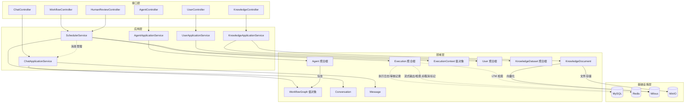

# 系统全局依赖拓扑 (System Overview)

## 业务域地图



## 核心数据流

1. **用户认证**: UserController → UserApplicationService → UserAuthenticationDomainService → ITokenService
2. **工作流执行**: Controller → SchedulerService → Execution(聚合根) → NodeExecutorStrategy → StreamPublisher
2. **记忆水合**: SchedulerService.hydrateMemory → VectorStore(LTM) + ConversationRepository(STM) → ExecutionContext
3. **人工审核**: HumanReviewController → SchedulerService.resumeExecution → Execution.resume → CheckpointRepository
4. **流式推送**: NodeExecutorStrategy → StreamPublisher → RedisSsePublisher(Redis Pub/Sub) → SSE → 前端
5. **知识检索**: VectorStore(Milvus) → longTermMemories → LLM System Prompt
6. **对话系统**: ChatController → ChatApplicationService → Conversation/Message → ConversationRepository
7. **执行完成**: SchedulerService.onExecutionComplete → extractFinalResponse + buildThoughtSteps → ChatApplicationService.completeAssistantMessage

## 工作流端口清单 (Domain Ports)

| 端口 | 职责 | 实现层 | 存储 |
|------|------|--------|------|
| ConditionEvaluatorPort | 结构化条件分支评估 | Infrastructure | - |
| NodeExecutorStrategy | 节点执行策略 | Infrastructure | - |
| StreamPublisher | 流式推送 | Infrastructure | Redis Pub/Sub |
| StreamPublisherFactory | 创建 StreamPublisher | Infrastructure | - |
| ExecutionRepository | 执行持久化 | Infrastructure | Redis + MySQL |
| CheckpointRepository | 检查点管理 | Infrastructure | Redis |
| WorkflowNodeExecutionLogRepository | 执行日志 | Infrastructure | MySQL |
| HumanReviewRepository | 审核记录 | Infrastructure | MySQL |
| HumanReviewQueuePort | 审核队列 | Infrastructure | Redis |
| WorkflowCancellationPort | 取消标记 | Infrastructure | Redis |
| VectorStore | 向量检索 (LTM) | Infrastructure | Milvus |

## 模块边界规则

| 领域 | 可以依赖 | 严禁依赖 |
|------|---------|---------|
| workflow | agent(读取图定义), knowledge(检索) | chat, user |
| agent | 无其他领域 | workflow, chat, knowledge |
| chat | agent(获取配置) | workflow内部实现, knowledge |
| knowledge | 无其他领域 | workflow, chat, agent |
| user/auth | 无其他领域 | 所有业务领域 |

注: SchedulerService (应用层) 可以调用 ChatApplicationService 管理消息，这是应用层编排的合法跨域协调。

## 关键技术决策

- Execution 是工作流执行的聚合根，管理完整生命周期和状态机
- WorkflowGraph 是值对象，提供拓扑排序和环检测
- ExecutionContext 是"智能黑板"，承载 LTM/STM/Awareness 三层记忆模型
- NodeExecutorStrategy 策略模式，支持 START/END/LLM/CONDITION/HTTP/TOOL 六种节点类型
- 条件节点支持 EXPRESSION(SpEL) 和 LLM(语义理解) 两种路由模式
- Redis 临时存储执行上下文、检查点和取消标记；MySQL 持久化最终结果和审计日志
- SSE (Server-Sent Events) 通过 Redis Pub/Sub 实现流式输出，StreamPublisher 抽象推送接口
- 人工审核支持 BEFORE_EXECUTION(审核输入) 和 AFTER_EXECUTION(审核输出) 两个阶段
- ExecutionMode 支持 STANDARD/DEBUG/DRY_RUN 三种运行模式

## 蓝图文件索引

```
.blueprint/
├── _overview.md                              ← 本文件
├── domain/
│   ├── workflow/
│   │   ├── WorkflowEngine.md                 # Execution聚合根, WorkflowGraph, Node, Edge, 状态机
│   │   ├── ExecutionContext.md                # 智能黑板, LTM/STM/Awareness, SpEL解析
│   │   ├── NodeExecutor.md                   # 策略接口, StreamPublisher端口, NodeExecutionResult
│   │   └── HumanReview.md                    # 审核记录, 触发阶段, 审核队列
│   ├── agent/AgentService.md
│   ├── chat/ChatService.md
│   ├── knowledge/KnowledgeService.md
│   └── auth/AuthService.md
├── application/
│   ├── SchedulerService.md                   # 工作流编排核心, 记忆水合, 消息管理
│   ├── AgentApplicationService.md
│   └── KnowledgeApplicationService.md
├── infrastructure/
│   ├── adapters/
│   │   ├── NodeExecutors.md                  # 六种执行器实现, 流式推送, 持久化
│   │   └── ExternalServices.md
│   └── persistence/
│       ├── MySQLRepositories.md
│       └── RedisRepositories.md
└── interfaces/
    └── Controllers.md
```
