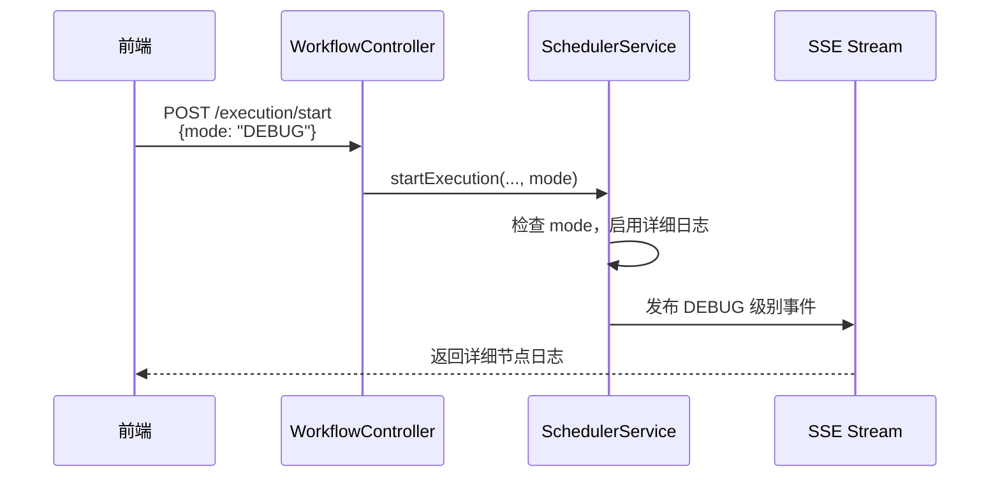
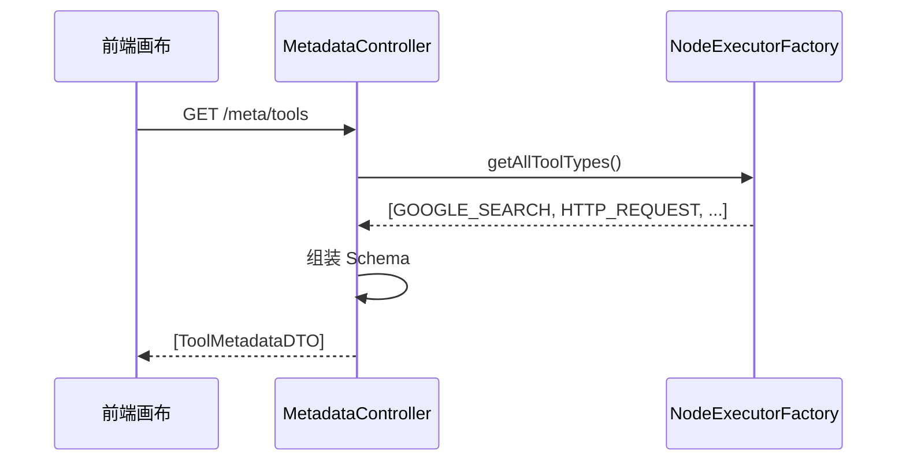

# API 一致性修正 - 设计文档

## 1. 业务背景

### 1.1 问题描述
通过 PRD 文档与代码对比，发现以下 API 不一致性问题：
1. HTTP 方法不符合 RESTful 规范
2. 功能冗余（Debug 接口重复）
3. 缺失调试支持接口

### 1.2 Ubiquitous Language
- **ExecutionMode**: 执行模式枚举（STANDARD/DEBUG/DRY_RUN）
- **Tool Metadata**: 工具元数据，包含 Schema 定义
- **Execution Context**: 执行上下文快照（LTM/STM/全局变量）

---

## 2. 领域建模

### 2.1 值对象 (Value Object)

#### ExecutionMode
```java
public enum ExecutionMode {
    STANDARD,   // 常规执行
    DEBUG,      // Debug 模式（详细日志）
    DRY_RUN     // 干运行（不持久化）
}
```

**职责**: 区分工作流执行的不同模式。

---

### 2.2 DTO 修改

#### StartExecutionRequest (修改)
**位置**: `WorkflowController.StartExecutionRequest`

**新增字段**:
```java
private ExecutionMode mode = ExecutionMode.STANDARD; // 默认标准模式
```

**影响**: 
- 替代 `AgentController.debugAgent()` 的 `debugMode` 标志
- 未来可扩展 `DRY_RUN` 模式

---

## 3. API 修正设计

### 3.1 AgentController 修正

#### 修正 1: DELETE 接口 RESTful 化
**现状**: `POST /api/agent/delete/{id}`  
**目标**: `DELETE /api/agent/{id}`

**实现**:
```java
@DeleteMapping("/{id}")
public Response<Void> deleteAgent(@PathVariable Long id) {
    // 保持原有逻辑不变
}
```

**兼容性**: 保留旧接口 2 个版本周期，添加 `@Deprecated` 标记。

---

#### 修正 2: 删除 Debug 接口
**移除**: `POST /api/agent/debug`

**替代方案**: 在 `WorkflowController.startExecution()` 中使用 `mode=DEBUG`

**前端迁移示例**:
```javascript
// 旧代码
POST /api/agent/debug { agentId, inputMessage, debugMode: true }

// 新代码
POST /api/workflow/execution/start {
  agentId, userId, inputs: { message: inputMessage },
  mode: "DEBUG"
}
```

---

### 3.2 UserController 修正

#### 修正: 用户修改接口
**现状**: `POST /client/user/modify`  
**目标**: `PATCH /client/user/profile`

**实现**:
```java
@PatchMapping("/profile")
public Response<UserDetailDTO> modifyUserInfo(
    @RequestHeader("Authorization") String token,
    @RequestBody UserRequests.ModifyUserRequest request) {
    // 保持原有逻辑不变
}
```

**兼容性**: 保留旧接口 2 个版本周期。

---

### 3.3 新增接口设计

#### 接口 1: 工具元数据接口
**路径**: `GET /api/meta/tools`  
**Controller**: 新建 `MetadataController`

**响应设计**:
```java
public class ToolMetadataDTO {
    private String toolId;
    private String name;
    private String description;
    private String icon;
    private JsonNode inputSchema;  // JSON Schema
    private JsonNode outputSchema;
}
```

**数据来源**:
- 从 `NodeExecutorFactory` 动态获取已注册的工具
- 或从配置文件/数据库加载静态元数据

**优先级**: P0（前端画布依赖）

---

#### 接口 2: 上下文调试接口
**路径**: `GET /api/workflow/execution/{executionId}/context`  
**Controller**: `WorkflowController`

**响应设计**:
```java
public class ExecutionContextDTO {
    private String executionId;
    private List<String> longTermMemories; // LTM
    private List<ChatMessage> chatHistory;  // STM
    private String executionLog;           // 节点执行轨迹
    private Map<String, Object> globalVariables;
}
```

**实现逻辑**:
1. 从 `ExecutionRepository` 获取 `Execution`
2. 提取 `context.getLongTermMemory()`, `context.getShortTermMemory()`
3. 从 `WorkflowNodeExecutionLogRepository` 查询执行日志
4. 组装返回 DTO

**优先级**: P1（调试工具）

---

## 4. 交互时序

### 4.1 Debug 模式执行流程



### 4.2 获取工具元数据流程



---

## 5. 技术决策

### 5.1 ExecutionMode 的行为差异

| Mode | 持久化 | 日志级别 | 真实调用 | 用途 |
|------|--------|----------|----------|------|
| **STANDARD** | ✅ | INFO | ✅ | 生产环境 |
| **DEBUG** | ✅ | DEBUG/TRACE | ✅ | 开发调试 |
| **DRY_RUN** | ❌ | INFO | ❌ Mock | 测试验证 |

### 5.2 兼容性策略
- 所有修改后的接口，旧路径保留 2 个版本周期
- 在响应 Header 中添加 `X-Deprecated-API: true`
- 前端迁移文档需提前 1 周发布

---

## 6. 风险评估

| 风险 | 影响 | 缓解措施 |
|------|------|---------|
| 前端调用方需同步修改 | 高 | 保留旧接口 2 个版本周期，提供迁移指南 |
| Debug 模式行为差异 | 中 | 详细文档说明 `mode` 参数的行为 |
| 工具元数据 Schema 不完整 | 低 | 初版仅支持核心工具，逐步补充 |

---

##7. 验收标准
- [ ] `DELETE /agent/{id}` 可正常删除 Agent
- [ ] `PATCH /user/profile` 可部分更新用户信息
- [ ] `/agent/debug` 已删除 (返回 4404)
- [ ] `POST /execution/start` 支持 `mode` 参数
- [ ] `GET /meta/tools` 返回至少 5 个工具的 Schema
- [ ] `GET /execution/{id}/context` 返回完整的上下文快照
