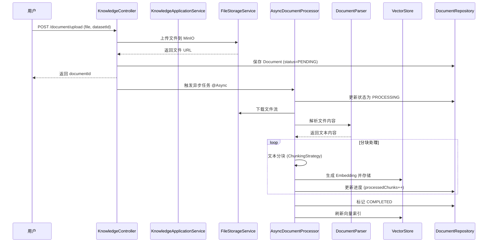
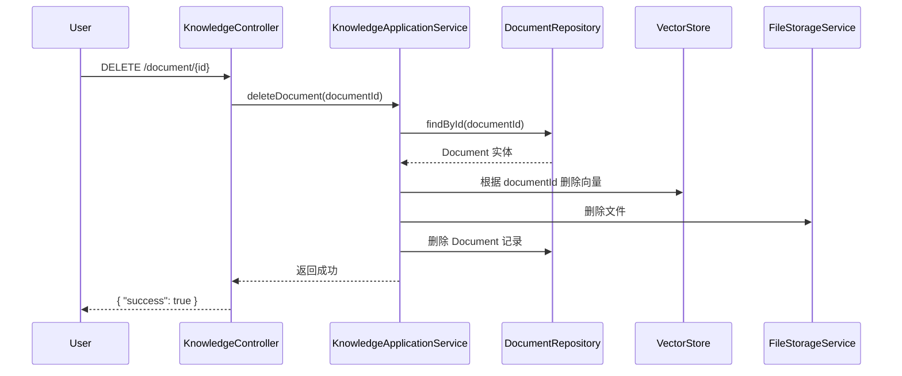

# 知识库管理 API - 设计文档

## 1. 背景与目标

### 1.1 业务背景
**现状问题**:
- 系统已实现 LTM（长期记忆）**读取**能力（`VectorStore.search()`）
- **缺失**：知识库的写入、管理、生命周期控制
- **痛点**：用户无法动态更新 Agent 的知识库

**业务价值**:
- 让用户能够上传产品手册、FAQ、技术文档等
- 支持知识库的增删改查
- 为 Agent 提供动态可扩展的长期记忆

### 1.2 Ubiquitous Language（通用语言）
- **KnowledgeDataset（知识库）**: 一个独立的知识集合，对应 Milvus 中的一个 Collection
- **KnowledgeDocument（知识文档）**: 上传的单个文件（PDF/Markdown/TXT）
- **DocumentChunk（文档块）**: 文档分割后的片段，对应向量库中的一条 Embedding
- **Embedding（向量嵌入）**: 文本块的向量表示
- **DocumentParser（文档解析器）**: 将文件内容提取为文本的组件
- **ChunkingStrategy（分块策略）**: 将长文本切分为合适长度片段的策略

---

## 2. 领域模型（DDD 战术设计）

### 2.1 聚合根 (Aggregate Root)

#### KnowledgeDataset (知识库聚合根)
**职责**: 管理知识库的生命周期、文档集合

> **⚠️ 架构优化**: 移除 `collectionName` 字段。采用 **单 Collection + Metadata 过滤** 策略，所有 Agent 的知识存储在统一的 `agent_knowledge_base` Collection 中，通过 `agentId` 和 `datasetId` 在 Metadata 中进行隔离。

```java
package com.zj.aiagent.domain.knowledge.entity;

public class KnowledgeDataset {
    // === 标识 ===
    private String datasetId;  // 聚合根 ID
    
    // === 基本信息 ===
    private String name;
    private String description;
    private Long userId;  // 所有者
    private Long agentId;  // 可选：绑定的 Agent ID
    
    // === 向量存储映射 ===
    // 移除 collectionName，所有知识库共享 "agent_knowledge_base" Collection
    // 通过 Metadata { "agentId": xxx, "datasetId": xxx } 进行隔离
    
    // === 统计信息 ===
    private Integer documentCount;
    private Integer totalChunks;
    
    // === 审计字段 ===
    private Instant createdAt;
    private Instant updatedAt;
    
    // === 领域行为 ===
    public void addDocument(KnowledgeDocument document) {
        this.documentCount++;
        this.updatedAt = Instant.now();
    }
    
    public void removeDocument(int chunkCount) {
        this.documentCount--;
        this.totalChunks -= chunkCount;
        this.updatedAt = Instant.now();
    }
    
    // 新增：获取向量检索的 Metadata Filter
    public Map<String, Object> buildMetadataFilter() {
        Map<String, Object> filter = new HashMap<>();
        filter.put("datasetId", this.datasetId);
        if (this.agentId != null) {
            filter.put("agentId", this.agentId);
        }
        return filter;
    }
}
```

---

#### KnowledgeDocument (文档聚合根)
**职责**: 管理单个文档的解析状态、分块进度、错误处理

```java
package com.zj.aiagent.domain.knowledge.entity;

public class KnowledgeDocument {
    // === 标识 ===
    private String documentId;
    private String datasetId;  // 所属知识库
    
    // === 文件信息 ===
    private String filename;
    private String fileUrl;  // MinIO 存储路径
    private Long fileSize;
    private String contentType;  // application/pdf, text/markdown
    
    // === 状态管理 ===
    private DocumentStatus status;  // PENDING, PROCESSING, COMPLETED, FAILED
    private Integer totalChunks;
    private Integer processedChunks;
    private String errorMessage;
    
    // === 解析配置 ===
    private ChunkingConfig chunkingConfig;
    
    // === 审计字段 ===
    private Instant uploadedAt;
    private Instant completedAt;
    
    // === 领域行为 ===
    public void startProcessing() {
        this.status = DocumentStatus.PROCESSING;
    }
    
    public void updateProgress(int processedChunks) {
        this.processedChunks = processedChunks;
    }
    
    public void markCompleted() {
        this.status = DocumentStatus.COMPLETED;
        this.completedAt = Instant.now();
    }
    
    public void markFailed(String errorMessage) {
        this.status = DocumentStatus.FAILED;
        this.errorMessage = errorMessage;
    }
}
```

---

### 2.2 值对象 (Value Object)

#### DocumentStatus（文档状态）
```java
public enum DocumentStatus {
    PENDING,      // 已上传，等待处理
    PROCESSING,   // 正在解析向量化
    COMPLETED,    // 完成
    FAILED        // 失败
}
```

#### ChunkingConfig（分块配置）
```java
@Data
@Builder
public class ChunkingConfig {
    private Integer chunkSize;     // 默认 500
    private Integer chunkOverlap;  // 默认 50
    private ChunkingStrategy strategy;  // FIXED_LENGTH, SENTENCE
}
```

#### DocumentChunk（文档块 - 值对象）
```java
@Data
@Builder
public class DocumentChunk {
    private String chunkId;
    private String content;
    private Integer sequenceNumber;  // 在文档中的顺序
    private Map<String, Object> metadata;  // { "page": 12, "section": "定价" }
}
```

---

### 2.3 领域服务 (Domain Service)

#### DocumentProcessingService（文档处理领域服务）
**职责**: 协调文档解析、分块、向量化的复杂流程

```java
public interface DocumentProcessingService {
    /**
     * 处理文档，生成向量并存储
     */
    void processDocument(KnowledgeDocument document, InputStream fileStream);
}
```

#### KnowledgeRetrievalService（知识检索领域服务）
**职责**: 为 SchedulerService 提供长期记忆检索能力，自动过滤 Agent 权限

> **🔗 与 SchedulerService 联动**: 在工作流启动前，SchedulerService 调用此服务加载 LTM。

```java
public interface KnowledgeRetrievalService {
    /**
     * 根据 Agent ID 和查询检索知识
     * 
     * @param agentId Agent ID（用于权限隔离）
     * @param query   用户查询文本
     * @param topK    返回结果数量
     * @return 相关知识片段
     */
    List<String> retrieve(Long agentId, String query, int topK);
    
    /**
     * 根据 Dataset ID 检索（测试用）
     */
    List<String> retrieveByDataset(String datasetId, String query, int topK);
}
```

---

### 2.4 仓储接口 (Repository Port)

```java
public interface KnowledgeDatasetRepository {
    KnowledgeDataset save(KnowledgeDataset dataset);
    Optional<KnowledgeDataset> findById(String datasetId);
    List<KnowledgeDataset> findByUserId(Long userId);
    void deleteById(String datasetId);
}

public interface KnowledgeDocumentRepository {
    KnowledgeDocument save(KnowledgeDocument document);
    Optional<KnowledgeDocument> findById(String documentId);
    Page<KnowledgeDocument> findByDatasetId(String datasetId, Pageable pageable);
    void deleteById(String documentId);
}
```

---

### 2.5 基础设施接口 (Infrastructure Port)

#### FileStorageService（文件存储服务）
```java
public interface FileStorageService {
    String upload(String bucketName, String objectName, InputStream inputStream, long size);
    InputStream download(String bucketName, String objectName);
    void delete(String bucketName, String objectName);
}
```

#### DocumentReaderAdapter（文档读取适配器）
> **✅ 架构优化**: 复用 **Spring AI** 的 `DocumentReader` 抽象，而非手写解析器。

```java
public interface DocumentReaderAdapter {
    /**
     * 使用 Spring AI TikaDocumentReader 读取文档
     * 支持 PDF, DOCX, TXT, MD 等多种格式
     */
    List<org.springframework.ai.document.Document> readDocuments(Resource resource);
}
```

#### TextSplitterAdapter（文本分块适配器）
> **✅ 架构优化**: 复用 **Spring AI** 的 `TokenTextSplitter`，无需手写分块逻辑。

```java
public interface TextSplitterAdapter {
    /**
     * 使用 Spring AI TokenTextSplitter 分块
     */
    List<org.springframework.ai.document.Document> split(
        List<org.springframework.ai.document.Document> documents,
        int chunkSize,
        int overlap
    );
}
```

---

## 3. API 接口设计

### 3.1 Controller 层

#### KnowledgeController
**路径**: `com.zj.aiagent.interfaces.knowledge.KnowledgeController`

**接口列表**:
| Method | Path | 描述 |
|--------|------|------|
| POST | `/api/knowledge/dataset` | 创建知识库 |
| GET | `/api/knowledge/dataset/list` | 查询知识库列表 |
| DELETE | `/api/knowledge/dataset/{id}` | 删除知识库 |
| POST | `/api/knowledge/document/upload` | 上传文档 |
| GET | `/api/knowledge/document/list` | 文档列表 |
| GET | `/api/knowledge/document/{id}` | 文档详情 |
| DELETE | `/api/knowledge/document/{id}` | 删除文档 |
| POST | `/api/knowledge/search` | 测试检索 |

---

## 4. 交互时序

### 4.1 文档上传与向量化流程



---

### 4.2 删除文档流程



---

## 5. 技术决策

### 5.1 文件存储：MinIO
**选型原因**:
- 开源对象存储，兼容 AWS S3 API
- 支持本地部署，降低开发成本
- Spring Boot 集成简单

**配置示例**:
```yaml
minio:
  endpoint: http://localhost:9000
  access-key: minioadmin
  secret-key: minioadmin
  bucket-name: knowledge-files
```

### 5.2 异步处理：Spring @Async
- 文档解析和向量化是 **CPU 密集型** 任务，使用异步避免阻塞 API 请求
- 配置线程池：`@EnableAsync` + `TaskExecutor`

### 5.3 文档解析与分块：Spring AI 集成
> **✅ 关键优化**: 直接复用 **Spring AI ETL** 能力，避免重复造轮子。

**Spring AI 提供的能力**:
- **TikaDocumentReader**: 基于 Apache Tika，开箱即用支持 PDF, DOCX, TXT, MD 等 20+ 格式
- **TokenTextSplitter**: 智能分块，支持 Token 计数、重叠策略
- **Document 抽象**: 统一的文档对象，包含 `content` 和 `metadata`

**依赖配置**:
```xml
<dependency>
    <groupId>org.springframework.ai</groupId>
    <artifactId>spring-ai-tika-document-reader</artifactId>
</dependency>
<dependency>
    <groupId>org.springframework.ai</groupId>
    <artifactId>spring-ai-core</artifactId>
</dependency>
```

**实现示例**:
```java
// Infrastructure 层封装
public class SpringAIDocumentReaderAdapter implements DocumentReaderAdapter {
    @Override
    public List<Document> readDocuments(Resource resource) {
        TikaDocumentReader reader = new TikaDocumentReader(resource);
        return reader.get(); // 自动检测格式并解析
    }
}

public class SpringAITextSplitterAdapter implements TextSplitterAdapter {
    @Override
    public List<Document> split(List<Document> documents, int chunkSize, int overlap) {
        TokenTextSplitter splitter = new TokenTextSplitter(chunkSize, overlap);
        return splitter.split(documents);
    }
}
```

### 5.4 向量检索隔离策略
> **✅ 关键优化**: 采用 **单 Collection + Metadata 过滤** 策略。

**设计原则**:
- ❌ **不推荐**: 为每个 Dataset 创建独立 Collection（频繁创建/删除 Collection 是重操作）
- ✅ **推荐**: 所有 Agent 知识存储在统一的 `agent_knowledge_base` Collection

**隔离策略**:
```java
// 存储时：在 Metadata 中注入 agentId 和 datasetId
Map<String, Object> metadata = new HashMap<>();
metadata.put("agentId", 1001L);
metadata.put("datasetId", "ds_abc");
metadata.put("documentId", "doc_456");
metadata.put("filename", "产品手册.pdf");
metadata.put("page", 12);

vectorStore.store(agentId, chunkContent, metadata);
```

```java
// 检索时：使用 Metadata Filter
List<String> results = knowledgeRetrievalService.retrieve(
    agentId: 1001,
    query: "产品价格",
    topK: 5
);

// 内部实现会构造 Filter：agentId == 1001
// 如果指定 datasetId，则额外过滤：datasetId == "ds_abc"
```

**优势**:
- ✅ 避免频繁创建/删除 Collection 的性能开销
- ✅ 简化 SchedulerService 集成（只需传 agentId）
- ✅ 支持跨 Dataset 的知识融合检索

---

## 6. 风险评估

| 风险 | 影响 | 缓解措施 |
|------|------|---------|
| PDF 解析失败（扫描件） | 高 | 捕获异常，标记 FAILED，记录详细错误 |
| MinIO 连接失败 | 高 | 配置重试机制，健康检查 |
| 向量化耗时过长 | 中 | 使用批量处理，限制并发任务数 |
| 文件上传超大（>10MB） | 中 | 前端验证 + 后端文件大小校验 |

---

## 7. 验收标准

- [ ] **P0**: 支持上传 PDF/Markdown/TXT 文件至 MinIO
- [ ] **P0**: 文档解析成功后，向量写入 Milvus（通过 `VectorStore`）
- [ ] **P0**: 文档列表 API 能显示解析进度（processedChunks/totalChunks）
- [ ] **P0**: 删除文档后，MinIO 文件和 Milvus 向量同步删除
- [ ] **P0**: 异步任务失败时，状态标记为 FAILED 并记录 errorMessage
- [ ] **P1**: 搜索 API 能检索到上传的内容（topK=5）

---

## 8. 分层实现计划（预览）

### Domain Layer
- `KnowledgeDataset` 聚合根
- `KnowledgeDocument` 聚合根
- `DocumentStatus` 枚举
- `ChunkingConfig` 值对象
- Repository 接口

### Infrastructure Layer
- `MilvusVectorStoreImpl` (已有，**需扩展**: 支持 Metadata Filter 查询)
- `MinIOFileStorageService` (新增)
- ~~`PDFDocumentParser`~~ → **改为**: `SpringAIDocumentReaderAdapter` (复用 Spring AI TikaDocumentReader)
- ~~`MarkdownParser`~~ → **已包含在** Spring AI Tika 中
- `SpringAITextSplitterAdapter` (新增，封装 TokenTextSplitter)
- `MySQLKnowledgeDatasetRepository` (新增)
- `MySQLKnowledgeDocumentRepository` (新增)

### Application Layer
- `KnowledgeApplicationService` (知识库 CRUD)
- `AsyncDocumentProcessor` (@Async 文档解析)
- `KnowledgeRetrievalServiceImpl` (实现 Domain Service，供 SchedulerService 调用)

### Interface Layer
- `KnowledgeController`
- DTOs: `DatasetCreateRequest`, `DocumentUploadResponse`, etc.

---

> **⛔ STOP POINT**: 设计文档生成完毕。请确认设计是否通过？（输入 '通过' 进入任务拆解）
