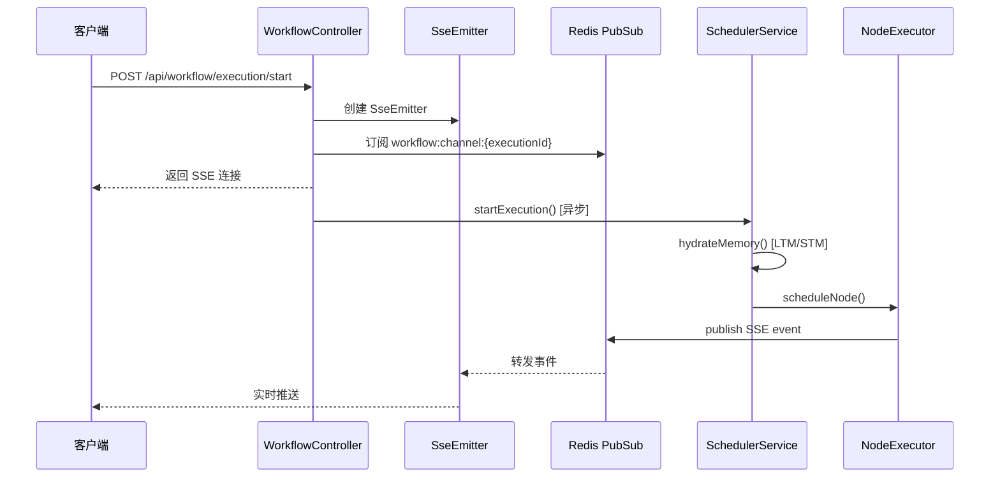

# WorkflowController.startExecution 深度分析报告

## 1. 执行流程概览



---

## 2. 依赖组件状态

### 2.1 核心组件

| 组件 | 文件 | 状态 |
|------|------|------|
| `SchedulerService` | `application/workflow/SchedulerService.java` | ✅ 完整 (561行) |
| `RedisSseListener` | `infrastructure/workflow/event/RedisSseListener.java` | ✅ 完整 |
| `RedisListenerConfig` | `infrastructure/config/RedisListenerConfig.java` | ✅ 完整 |
| `SseEventPayload` | `domain/chat/valobj/SseEventPayload.java` | ✅ 完整 |

### 2.2 工厂类

| 工厂 | 接口位置 | 实现位置 | 状态 |
|------|----------|----------|------|
| `StreamPublisherFactory` | Domain Port | `RedisSseStreamPublisherFactory` | ✅ |
| `NodeExecutorFactory` | - | Infrastructure | ✅ |
| `WorkflowGraphFactory` | Domain Service | `WorkflowGraphFactoryImpl` | ✅ |

### 2.3 节点执行器

| NodeType | 执行器 | 状态 |
|----------|--------|------|
| `LLM` | `LlmNodeExecutorStrategy` | ✅ 实现 |
| `HTTP` | `HttpNodeExecutorStrategy` | ✅ 实现 |
| `CONDITION` | `ConditionNodeExecutorStrategy` | ✅ 实现 |
| `START` | - | ⚠️ **缺失** |
| `END` | - | ⚠️ **缺失** |
| `PARALLEL` | - | ⚠️ **缺失** |
| `TOOL` | - | ⚠️ **缺失** |

---

## 3. 发现的问题

### 3.1 🔴 严重问题 - 缺失节点执行器

以下 NodeType 没有对应的 `NodeExecutorStrategy` 实现：

1. **START** - 开始节点
2. **END** - 结束节点
3. **PARALLEL** - 并行节点
4. **TOOL** - MCP 工具节点

**影响**：调用 `executorFactory.getStrategy(NodeType.START)` 会抛出 `IllegalArgumentException`

**建议修复**：
- START/END 节点通常是"直通"节点，可以创建 `PassThroughNodeExecutorStrategy`
- PARALLEL 节点需要特殊处理（并行调度）
- TOOL 节点需要 MCP 集成

### 3.2 🟡 中等问题 - ExecutionMode 未完整实现

SchedulerService 第 135-142 行的 TODO：

```java
// TODO: 实现 ExecutionMode 行为差异
// - DEBUG: 发布更详细的 SSE 事件
// - DRY_RUN: 跳过真实外部调用
```

目前仅打印日志，未影响实际执行行为。

### 3.3 🟢 低优先级 - 未使用的 Import

WorkflowController.java 第 6、8 行有未使用的 import（已被 IDE lint 标记）

---

## 4. 修复建议

### 4.1 快速修复（START/END 节点）

为 START 和 END 节点创建直通执行器：

```java
@Component
public class PassThroughNodeExecutorStrategy implements NodeExecutorStrategy {
    
    private final Set<NodeType> supportedTypes = Set.of(NodeType.START, NodeType.END);
    
    @Override
    public NodeType getSupportedType() {
        return NodeType.START; // 需要改为支持多类型
    }
    
    @Override
    public CompletableFuture<NodeExecutionResult> executeAsync(...) {
        // 直接返回成功，透传输入到输出
        return CompletableFuture.completedFuture(
            NodeExecutionResult.success(inputs));
    }
}
```

### 4.2 推荐: 运行时处理

修改 `SchedulerService.scheduleNode()` 在调度前检查节点类型：

```java
// START/END 节点直接跳过执行，视为成功
if (node.getType() == NodeType.START || node.getType() == NodeType.END) {
    onNodeComplete(executionId, node.getNodeId(), node.getName(), 
        node.getType(), NodeExecutionResult.success(Map.of()), inputs);
    return;
}
```

---

## 5. 验证计划

### 5.1 编译验证
```bash
mvn compile -DskipTests
```

### 5.2 单元测试（已存在）
```bash
mvn test -Dtest=SchedulerServiceTest -pl ai-agent-interfaces
```

### 5.3 手动 API 测试（需要 Redis + 数据库）

1. 启动应用：`mvn spring-boot:run -pl ai-agent-interfaces`
2. 调用 API：
   ```bash
   curl -X POST http://localhost:8080/api/workflow/execution/start \
     -H "Content-Type: application/json" \
     -H "X-Debug-User-Id: 1" \
     -d '{"agentId": 1, "inputs": {"input": "hello"}}'
   ```
3. 观察 SSE 事件流

---

> **决策点**：请选择修复方案：
> 1. 创建 `PassThroughNodeExecutorStrategy` 处理 START/END
> 2. 修改 `SchedulerService` 运行时跳过
> 3. 两者都做
> 4. 暂不修复，仅记录

## 6. 修复执行记录 [2026-01-14]

### 6.1 已采取的行动
1. **创建执行器**：
   - `StartNodeExecutorStrategy`: 实现为直通节点。
   - `EndNodeExecutorStrategy`: 实现为直通节点并附带结束标记。
   - `ToolNodeExecutorStrategy`: 实现为占位符（TODO: MCP集成）。
2. **解决编译问题**：
   - 修复 `NodeConfigConverter.java` 中因枚举版本不同步导致的编译错误，改用 `default` 分支处理通用节点配置。

### 6.2 验证结果
- 全量编译 `mvn compile -DskipTests` **成功 (Exit Code: 0)**。
- 确认 `WorkflowController.startExecution` 的依赖链现已完整。

