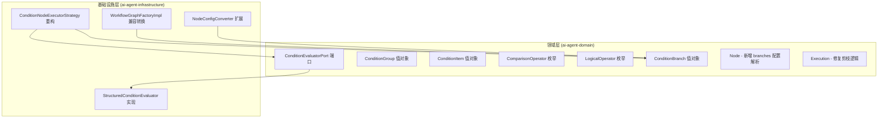

# Design Document: Condition Branch Refactor

## Overview

本设计将条件分支节点从"条件存储在 Edge 上的单条件模型"改造为"条件存储在 Node 配置中的多分支模型"。核心变更是引入 `ConditionBranch`、`ConditionGroup`、`ConditionItem` 三层条件数据结构，将条件评估逻辑从直接使用 SpEL 改为基于结构化操作符的安全评估器，同时修复剪枝逻辑中的 7 个已知缺陷。

设计遵循项目现有的 DDD + 六边形架构，新增的领域模型放在 Domain 层，评估器实现放在 Infrastructure 层。

## Architecture



**依赖方向保持不变**: `interfaces → application → domain ← infrastructure`

**关键决策**:
1. 条件模型（Branch/Group/Item）定义在 Domain 层，作为值对象
2. ConditionEvaluatorPort 定义在 Domain 层，实现在 Infrastructure 层
3. 条件数据从 NodeConfig.properties 中解析，不再依赖 Edge.condition
4. Edge 保留 condition 字段用于向后兼容，但新模型优先从 NodeConfig 读取 branches

## Components and Interfaces

### 1. 领域层新增值对象

#### ConditionBranch (值对象)
```java
package com.zj.aiagent.domain.workflow.valobj;

@Data @Builder @NoArgsConstructor @AllArgsConstructor
public class ConditionBranch {
    /** 分支优先级（0 起始，越小越优先） */
    private int priority;
    /** 目标节点 ID */
    private String targetNodeId;
    /** 分支描述（LLM 模式使用） */
    private String description;
    /** 是否为默认分支（else） */
    private boolean isDefault;
    /** 条件组列表（AND 关系：所有组都满足才命中） */
    private List<ConditionGroup> conditionGroups;
}
```

#### ConditionGroup (值对象)
```java
package com.zj.aiagent.domain.workflow.valobj;

@Data @Builder @NoArgsConstructor @AllArgsConstructor
public class ConditionGroup {
    /** 组内逻辑操作符 */
    private LogicalOperator operator; // AND or OR
    /** 条件项列表 */
    private List<ConditionItem> conditions;
}
```

#### ConditionItem (值对象)
```java
package com.zj.aiagent.domain.workflow.valobj;

@Data @Builder @NoArgsConstructor @AllArgsConstructor
public class ConditionItem {
    /** 左操作数（变量引用，如 "nodes.llm_1.output" 或 "inputs.query"） */
    private String leftOperand;
    /** 比较操作符 */
    private ComparisonOperator operator;
    /** 右操作数（字面值或变量引用） */
    private Object rightOperand;
}
```

#### ComparisonOperator (枚举)
```java
public enum ComparisonOperator {
    EQUALS, NOT_EQUALS,
    CONTAINS, NOT_CONTAINS,
    GREATER_THAN, LESS_THAN,
    GREATER_THAN_OR_EQUAL, LESS_THAN_OR_EQUAL,
    IS_EMPTY, IS_NOT_EMPTY,
    STARTS_WITH, ENDS_WITH
}
```

#### LogicalOperator (枚举)
```java
public enum LogicalOperator {
    AND, OR
}
```

### 2. 领域层端口

#### ConditionEvaluatorPort
```java
package com.zj.aiagent.domain.workflow.port;

public interface ConditionEvaluatorPort {
    /**
     * 评估分支列表，返回命中的分支
     * @param branches 按优先级排序的分支列表
     * @param context  变量解析上下文
     * @return 命中的分支，如果没有命中则返回 default 分支
     */
    ConditionBranch evaluate(List<ConditionBranch> branches, 
                             ExecutionContext context);
}
```

### 3. 基础设施层实现

#### StructuredConditionEvaluator
```java
package com.zj.aiagent.infrastructure.workflow.condition;

@Slf4j
@Component
public class StructuredConditionEvaluator implements ConditionEvaluatorPort {

    @Override
    public ConditionBranch evaluate(List<ConditionBranch> branches, 
                                     ExecutionContext context) {
        // 1. 按 priority 排序
        // 2. 跳过 default 分支
        // 3. 逐个评估非 default 分支的 conditionGroups（AND 关系）
        // 4. 每个 group 内按 operator（AND/OR）评估 conditions
        // 5. 首个命中的分支胜出
        // 6. 无命中则返回 default 分支
        // 7. 无 default 分支则抛出 ConditionEvaluationException
    }

    /** 解析变量引用，从 ExecutionContext 获取值 */
    private Object resolveOperand(String operand, ExecutionContext context) {
        // 支持 "nodes.{nodeId}.{key}" 和 "inputs.{key}" 格式
        // 变量不存在时返回 null
    }

    /** 执行单个条件比较 */
    private boolean compareValues(Object left, ComparisonOperator op, Object right) {
        // 基于 ComparisonOperator 枚举执行类型安全的比较
        // 支持 String、Number、null 的比较
    }
}
```

#### ConditionNodeExecutorStrategy 重构

重构后的执行流程：

```
EXPRESSION 模式:
1. 从 NodeConfig.properties["branches"] 解析 List<ConditionBranch>
2. 如果 branches 为空，尝试从 __outgoingEdges__ 做旧模型兼容转换
3. 调用 ConditionEvaluatorPort.evaluate(branches, context)
4. 返回 NodeExecutionResult.routing(branch.targetNodeId, outputs)

LLM 模式:
1. 从 NodeConfig.properties["branches"] 解析 List<ConditionBranch>
2. 构建 Prompt，使用 branch.description 描述各分支
3. 调用 LLM，解析返回的目标 ID
4. 匹配失败时重试一次（带澄清 prompt）
5. 重试仍失败则使用 default 分支
```

### 4. Execution 剪枝逻辑修复

#### pruneUnselectedBranches 修复
```java
private void pruneUnselectedBranches(String conditionNodeId, String selectedBranchId) {
    // selectedBranchId 是目标节点 ID
    Set<Node> successors = graph.getSuccessors(conditionNodeId);
    for (Node successor : successors) {
        // 直接比较 successor.nodeId 与 selectedBranchId
        if (!successor.getNodeId().equals(selectedBranchId)) {
            skipNodeRecursively(successor.getNodeId());
        }
    }
}
```

#### skipNodeRecursively 修复
```java
private void skipNodeRecursively(String nodeId) {
    ExecutionStatus currentStatus = nodeStatuses.get(nodeId);
    if (currentStatus != ExecutionStatus.PENDING) return;

    nodeStatuses.put(nodeId, ExecutionStatus.SKIPPED);

    Set<Node> successors = graph.getSuccessors(nodeId);
    for (Node successor : successors) {
        Set<Node> predecessors = graph.getPredecessors(successor.getNodeId());
        
        if (predecessors.size() <= 1) {
            // 单前驱：直接递归跳过
            skipNodeRecursively(successor.getNodeId());
        } else {
            // 汇聚节点：仅当所有前驱都是 SKIPPED 时才跳过
            boolean allPredecessorsSkipped = predecessors.stream()
                .allMatch(pred -> nodeStatuses.get(pred.getNodeId()) == ExecutionStatus.SKIPPED);
            if (allPredecessorsSkipped) {
                skipNodeRecursively(successor.getNodeId());
            }
            // 否则不跳过，等待其他分支的前驱完成
        }
    }
}
```

### 5. WorkflowGraphFactoryImpl 兼容转换

```java
/** 将旧模型 Edge 转换为新模型 ConditionBranch */
private List<ConditionBranch> convertLegacyEdgesToBranches(List<Edge> edges) {
    List<ConditionBranch> branches = new ArrayList<>();
    int priority = 0;
    
    for (Edge edge : edges) {
        if (edge.isDefault()) {
            branches.add(ConditionBranch.builder()
                .priority(Integer.MAX_VALUE)
                .targetNodeId(edge.getTarget())
                .isDefault(true)
                .build());
        } else {
            // 尝试将 SpEL 表达式解析为 ConditionItem
            ConditionItem item = parseLegacySpelToItem(edge.getCondition());
            if (item != null) {
                branches.add(ConditionBranch.builder()
                    .priority(priority++)
                    .targetNodeId(edge.getTarget())
                    .isDefault(false)
                    .conditionGroups(List.of(
                        ConditionGroup.builder()
                            .operator(LogicalOperator.AND)
                            .conditions(List.of(item))
                            .build()))
                    .build());
            } else {
                // 无法解析，作为 default 处理
                log.warn("无法解析旧条件表达式: {}, 作为 default 处理", edge.getCondition());
                branches.add(ConditionBranch.builder()
                    .priority(Integer.MAX_VALUE)
                    .targetNodeId(edge.getTarget())
                    .isDefault(true)
                    .build());
            }
        }
    }
    return branches;
}
```

## Data Models

### NodeConfig.properties 中的 branches 结构 (JSON)

```json
{
  "routingStrategy": "EXPRESSION",
  "branches": [
    {
      "priority": 0,
      "targetNodeId": "node_3",
      "description": "用户表达了购买意向",
      "isDefault": false,
      "conditionGroups": [
        {
          "operator": "AND",
          "conditions": [
            {
              "leftOperand": "nodes.llm_1.intent",
              "operator": "EQUALS",
              "rightOperand": "purchase"
            },
            {
              "leftOperand": "nodes.llm_1.confidence",
              "operator": "GREATER_THAN",
              "rightOperand": 0.8
            }
          ]
        }
      ]
    },
    {
      "priority": 1,
      "targetNodeId": "node_4",
      "description": "用户在咨询问题",
      "isDefault": false,
      "conditionGroups": [
        {
          "operator": "OR",
          "conditions": [
            {
              "leftOperand": "nodes.llm_1.intent",
              "operator": "EQUALS",
              "rightOperand": "question"
            },
            {
              "leftOperand": "nodes.llm_1.intent",
              "operator": "EQUALS",
              "rightOperand": "support"
            }
          ]
        }
      ]
    },
    {
      "priority": 2,
      "targetNodeId": "node_5",
      "description": "默认分支",
      "isDefault": true,
      "conditionGroups": []
    }
  ]
}
```

### 变量引用格式

| 格式 | 说明 | 示例 |
|------|------|------|
| `nodes.{nodeId}.{outputKey}` | 引用上游节点输出 | `nodes.llm_1.intent` |
| `inputs.{key}` | 引用全局输入 | `inputs.query` |

这与 ExecutionContext 中的 SpEL 变量注册方式对齐：
- `context.setVariable(nodeId, outputs)` → 通过 `nodes.{nodeId}.{key}` 访问
- `context.setVariable("inputs", inputs)` → 通过 `inputs.{key}` 访问

### Edge 模型变更

Edge 实体保持不变，但语义调整：
- `condition` 字段仅用于旧数据兼容，新数据不再使用
- `edgeType` 保留 DEPENDENCY / CONDITIONAL / DEFAULT 三种类型
- 条件逻辑完全由 NodeConfig.properties["branches"] 驱动

### isNodeInSelectedBranch 移除

移除 `isNodeInSelectedBranch` 方法，改为直接比较 `successor.getNodeId().equals(selectedBranchId)`。`selectedBranchId` 就是条件节点选中的目标节点 ID，直接与后继节点 ID 比较即可。


## Correctness Properties

*A property is a characteristic or behavior that should hold true across all valid executions of a system — essentially, a formal statement about what the system should do. Properties serve as the bridge between human-readable specifications and machine-verifiable correctness guarantees.*

### Property 1: Branch evaluation selects first matching by priority

*For any* ordered list of ConditionBranches (with exactly one default) and *for any* ExecutionContext, the Condition_Evaluator SHALL return the non-default branch with the lowest priority whose conditions are all satisfied; if no non-default branch matches, the evaluator SHALL return the default branch.

**Validates: Requirements 1.2, 1.4, 5.2**

### Property 2: Branch configuration serialization round-trip

*For any* valid List\<ConditionBranch\> (containing branches with priorities, condition groups, condition items, and exactly one default branch), serializing to JSON and deserializing back SHALL produce an equivalent list with identical priorities, operators, operands, and default flags.

**Validates: Requirements 1.5, 5.3**

### Property 3: Condition group logical evaluation

*For any* ConditionGroup with operator AND and a list of ConditionItems, the group SHALL evaluate to true if and only if all items evaluate to true. *For any* ConditionGroup with operator OR, the group SHALL evaluate to true if and only if at least one item evaluates to true.

**Validates: Requirements 2.2, 2.3**

### Property 4: Multi-group AND combination

*For any* ConditionBranch with multiple ConditionGroups, the branch SHALL match if and only if every ConditionGroup in the branch evaluates to true.

**Validates: Requirements 2.5**

### Property 5: Comparison operator correctness

*For any* pair of comparable values (String, Number, null) and *for any* ComparisonOperator, the `compareValues` function SHALL produce a result consistent with a reference implementation (e.g., EQUALS ↔ Objects.equals, GREATER_THAN ↔ Comparable.compareTo > 0, CONTAINS ↔ String.contains, IS_EMPTY ↔ value == null || value.toString().isEmpty()).

**Validates: Requirements 2.4**

### Property 6: Variable reference resolution

*For any* valid variable reference in the format `nodes.{nodeId}.{outputKey}` or `inputs.{key}`, and *for any* ExecutionContext containing the referenced value, the resolver SHALL return the exact value stored in the context. *For any* reference to a non-existent variable, the resolver SHALL return null (treating the condition as not satisfied).

**Validates: Requirements 2.6, 3.3, 8.2, 8.3**

### Property 7: Direct successor pruning

*For any* workflow graph where a condition node has N direct successors and one branch is selected, the Pruning_Engine SHALL mark exactly N-1 direct successors (those not equal to the selected target) as SKIPPED.

**Validates: Requirements 4.1**

### Property 8: Convergence node pruning correctness

*For any* workflow graph containing a convergence node (multiple predecessors), the Pruning_Engine SHALL skip the convergence node if and only if all of its predecessors are in SKIPPED status. If any predecessor is PENDING or SUCCEEDED (from a non-skipped branch), the convergence node SHALL remain PENDING.

**Validates: Requirements 4.2, 4.3**

### Property 9: LLM response target ID matching

*For any* valid target node ID and *for any* string that equals the target ID after trimming whitespace and ignoring case, the LLM response parser SHALL successfully match the target ID.

**Validates: Requirements 7.4**

### Property 10: Legacy edge to branch conversion

*For any* list of legacy Edges (with SpEL conditions and edge types), the converter SHALL produce a valid List\<ConditionBranch\> where: each CONDITIONAL edge becomes a non-default branch, each DEFAULT edge becomes a default branch, and the resulting branch list contains exactly one default branch.

**Validates: Requirements 9.1, 9.2**

## Error Handling

| 场景 | 处理方式 | 日志级别 |
|------|---------|---------|
| branches 配置为空且无旧模型边 | 返回 `NodeExecutionResult.failed("No branches defined")` | ERROR |
| 无 default 分支 | 抛出 `ConditionConfigurationException` | ERROR |
| 多个 default 分支 | 抛出 `ConditionConfigurationException` | ERROR |
| ConditionItem 的 operator 为 null | 跳过该 item，视为 false，记录日志 | WARN |
| 变量引用不存在 | 条件视为不满足，记录日志 | WARN |
| 比较类型不兼容（如 String vs Number） | 条件视为不满足，记录日志 | WARN |
| LLM 返回无效目标 ID | 重试一次，仍失败则使用 default 分支 | WARN |
| 旧 SpEL 表达式无法解析为新模型 | 作为 default 分支处理，记录日志 | WARN |

## Testing Strategy

### Property-Based Testing

使用 **jqwik** (Java property-based testing library) 作为 property-based testing 框架，集成到现有 Maven + JUnit 5 测试体系中。

每个 property test 配置最少 100 次迭代。每个 property test 必须用注释标注对应的设计文档 property 编号。

标注格式: `// Feature: condition-branch-refactor, Property N: {property_text}`

需要实现的 property tests:
1. **Property 1**: 生成随机 branches + context，验证评估结果是最低优先级匹配分支
2. **Property 2**: 生成随机 ConditionBranch 列表，JSON 序列化/反序列化后比较
3. **Property 3**: 生成随机 ConditionGroup (AND/OR) + items，验证逻辑运算正确性
4. **Property 4**: 生成随机多 group 分支，验证 AND 组合逻辑
5. **Property 5**: 生成随机值对 + 操作符，验证比较结果与参考实现一致
6. **Property 6**: 生成随机 ExecutionContext + 变量引用，验证解析结果
7. **Property 7**: 生成随机 DAG + 条件节点，验证剪枝后非选中后继为 SKIPPED
8. **Property 8**: 生成随机 DAG 含汇聚节点，验证汇聚节点仅在所有前驱 SKIPPED 时被跳过
9. **Property 9**: 生成随机目标 ID + 带空白/大小写变体的字符串，验证匹配
10. **Property 10**: 生成随机旧模型 Edge 列表，验证转换后的 branch 列表有效

### Unit Testing

单元测试聚焦于具体示例和边界情况：
- ConditionBranch 验证：无 default、多 default、空 branches
- ComparisonOperator：null 值比较、类型不兼容
- 旧模型兼容：典型 SpEL 表达式转换示例
- LLM 模式：prompt 构建、重试逻辑
- 剪枝：菱形 DAG（分支后汇聚）、多层嵌套分支
