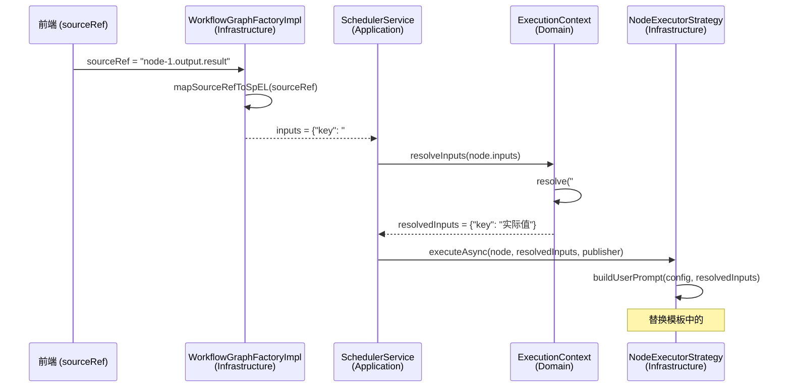

# Design Document: Fix Placeholder Resolution

## Overview

本设计修复工作流节点间占位符引用无法被正确解析的 bug。核心问题是 `WorkflowGraphFactoryImpl.extractInputs()` 生成 `${sourceRef}` 格式，而 `ExecutionContext.resolve()` 只识别 `#{...}` 格式，导致数据流断裂。

修复策略采用最小改动原则：
1. 在 `WorkflowGraphFactoryImpl` 中新增 sourceRef → SpEL 表达式的映射方法，生成 `#{...}` 格式
2. 增强 `ExecutionContext.resolve()` 的异常处理，解析失败时返回原始表达式并记录日志
3. 在 `LlmNodeExecutorStrategy` 和 `HttpNodeExecutorStrategy` 的模板替换中增加 `{{key}}` Mustache 风格支持

## Architecture

修复涉及三层，数据流如下：



修改范围：
- `WorkflowGraphFactoryImpl.extractInputs()` — 修改占位符生成逻辑
- `ExecutionContext.resolve()` — 增强异常处理
- `LlmNodeExecutorStrategy.buildUserPrompt()` — 增加 `{{key}}` 支持
- `HttpNodeExecutorStrategy.resolveTemplate()` — 增加 `{{key}}` 支持

## Components and Interfaces

### 1. WorkflowGraphFactoryImpl（修改）

新增 `mapSourceRefToSpEL(String sourceRef)` 方法，负责将前端 sourceRef 路径映射为 SpEL 表达式。

```java
/**
 * 将 sourceRef 路径映射为 SpEL 表达式
 * 
 * 映射规则：
 * - "nodeId.output.key"  → "#{#nodeId['key']}"
 * - "state.key"          → "#{#sharedState['key']}"
 * - "nodeId.key"         → "#{#nodeId['key']}"
 * 
 * @param sourceRef 前端配置的数据来源路径
 * @return SpEL 表达式字符串，或原始 sourceRef（格式不匹配时）
 */
static String mapSourceRefToSpEL(String sourceRef);

/**
 * 将 SpEL 表达式还原为 sourceRef 路径（Pretty Printer）
 * 
 * @param spel SpEL 表达式
 * @return sourceRef 路径
 */
static String mapSpELToSourceRef(String spel);
```

`extractInputs()` 方法修改：将 `"${" + field.getSourceRef() + "}"` 替换为 `mapSourceRefToSpEL(field.getSourceRef())`。

### 2. ExecutionContext.resolve()（修改）

增强异常处理：SpEL 解析失败时捕获异常，记录 WARN 日志，返回原始表达式。

```java
public Object resolve(String expression) {
    if (expression == null || !expression.startsWith("#{") || !expression.endsWith("}")) {
        return expression;
    }
    try {
        String spelExpression = expression.substring(2, expression.length() - 1);
        EvaluationContext context = buildEvaluationContext();
        Expression exp = PARSER.parseExpression(spelExpression);
        return exp.getValue(context);
    } catch (Exception e) {
        log.warn("SpEL 表达式解析失败: expression={}, error={}", expression, e.getMessage());
        return expression;
    }
}
```

注意：ExecutionContext 是领域层值对象，当前已使用 SpEL（`SpelExpressionParser`），增加 try-catch 不引入新的框架依赖。需要添加 `@Slf4j` 注解。

### 3. NodeExecutorStrategy 模板替换（修改）

在 `LlmNodeExecutorStrategy.buildUserPrompt()` 和 `HttpNodeExecutorStrategy.resolveTemplate()` 中增加 `{{key}}` Mustache 风格占位符支持。

```java
private String resolveTemplate(String template, Map<String, Object> resolvedInputs) {
    if (template == null) return null;
    String result = template;
    for (Map.Entry<String, Object> entry : resolvedInputs.entrySet()) {
        if (entry.getKey().startsWith("__")) continue; // 跳过内部变量
        if (entry.getValue() != null) {
            String value = entry.getValue().toString();
            // 支持 #{key} 格式
            result = result.replace("#{" + entry.getKey() + "}", value);
            // 支持 {{key}} Mustache 格式
            result = result.replace("{{" + entry.getKey() + "}}", value);
        }
    }
    return result;
}
```

## Data Models

### sourceRef 路径格式

| 格式 | 示例 | 含义 | SpEL 映射 |
|------|------|------|-----------|
| `<nodeId>.output.<key>` | `node-1.output.result` | 引用节点输出 | `#{#node-1['result']}` |
| `state.<key>` | `state.user_input` | 引用共享状态 | `#{#sharedState['user_input']}` |
| `<nodeId>.<key>` | `node-1.result` | 引用节点输出（简写） | `#{#node-1['result']}` |

### SpEL 变量注册（已有，无需修改）

`ExecutionContext.buildEvaluationContext()` 中：
- `#inputs` → 全局输入 Map
- `#sharedState` → 共享状态 Map
- `#<nodeId>` → 各节点输出 Map（通过 `context.setVariable(nodeId, outputs)` 注册）

### 模板占位符格式

| 格式 | 示例 | 使用场景 |
|------|------|---------|
| `#{key}` | `#{input}` | 现有格式，LLM/HTTP 节点模板 |
| `{{key}}` | `{{input}}` | 新增 Mustache 风格，用户友好 |


## Correctness Properties

*A property is a characteristic or behavior that should hold true across all valid executions of a system — essentially, a formal statement about what the system should do. Properties serve as the bridge between human-readable specifications and machine-verifiable correctness guarantees.*

### Property 1: sourceRef 映射正确性

*For any* 合法的 sourceRef 路径（`nodeId.output.key`、`state.key`、`nodeId.key` 三种格式），`mapSourceRefToSpEL()` 生成的 SpEL 表达式应包含正确的变量名和 key 引用：对于 `nodeId.output.key` 和 `nodeId.key` 格式，表达式中应引用 `#nodeId` 变量和 `key`；对于 `state.key` 格式，表达式中应引用 `#sharedState` 变量和 `key`。

**Validates: Requirements 2.1, 2.2, 2.3, 2.4**

### Property 2: sourceRef 到 SpEL 的 Round-Trip

*For any* 合法的 sourceRef 路径，调用 `mapSourceRefToSpEL()` 转换为 SpEL 表达式后，再调用 `mapSpELToSourceRef()` 还原，应产生与原始路径等价的 sourceRef。

**Validates: Requirements 2.5, 2.6**

### Property 3: 端到端解析正确性

*For any* nodeId、key 和 value 的组合，将 value 存入 `ExecutionContext.nodeOutputs[nodeId][key]`，然后通过 `mapSourceRefToSpEL("nodeId.output.key")` 生成 SpEL 表达式，再调用 `ExecutionContext.resolve()` 解析，返回值应等于原始 value。

**Validates: Requirements 1.1, 1.2, 1.3**

### Property 4: 模板占位符替换

*For any* 模板字符串和 resolvedInputs Map，模板中所有 `#{key}` 和 `{{key}}` 格式的占位符（其中 key 存在于 resolvedInputs 且值非 null）都应被替换为对应的值字符串。

**Validates: Requirements 3.1, 3.2**

### Property 5: 缺失 key 保留原始占位符

*For any* 模板字符串中包含的占位符 key 不存在于 resolvedInputs 中时，`resolveTemplate()` 的输出应保留该占位符的原始文本。

**Validates: Requirements 3.3**

### Property 6: SpEL 解析异常返回原始表达式

*For any* 格式正确但引用不存在变量的 SpEL 表达式（如 `#{#nonExistentNode['key']}`），`ExecutionContext.resolve()` 应返回原始表达式字符串而非抛出异常。

**Validates: Requirements 4.1**

## Error Handling

| 场景 | 处理方式 | 日志级别 |
|------|---------|---------|
| SpEL 表达式解析失败 | 返回原始表达式字符串 | WARN |
| sourceRef 格式不匹配 | 原值作为普通字符串传递 | WARN |
| resolvedInputs 值为 null | 跳过替换，保留占位符 | 无（正常行为） |
| nodeOutputs 中节点不存在 | SpEL 解析失败，走异常处理 | WARN |

关键原则：占位符解析失败不应中断工作流执行。所有解析错误都应被捕获并降级处理。

## Testing Strategy

### Property-Based Testing

使用 **jqwik**（Java property-based testing 库）实现 correctness properties 的自动化验证。每个 property test 运行至少 100 次迭代。

测试标签格式：`Feature: fix-placeholder-resolution, Property {number}: {property_text}`

### Unit Testing

针对以下场景编写 unit test：
- `mapSourceRefToSpEL()` 的各种 sourceRef 格式（具体示例）
- `mapSpELToSourceRef()` 的逆向映射
- `ExecutionContext.resolve()` 的异常处理
- `resolveTemplate()` 的 `{{key}}` 和 `#{key}` 混合替换
- 边界情况：空字符串、null、无 dot 的 sourceRef、内部变量 `__context__` 的跳过

### 测试文件位置

- Unit tests: `ai-agent-infrastructure/src/test/java/.../WorkflowGraphFactoryImplTest.java`
- Unit tests: `ai-agent-domain/src/test/java/.../ExecutionContextTest.java`
- Property tests: 与 unit test 同文件，使用 `@Property` 注解标记
