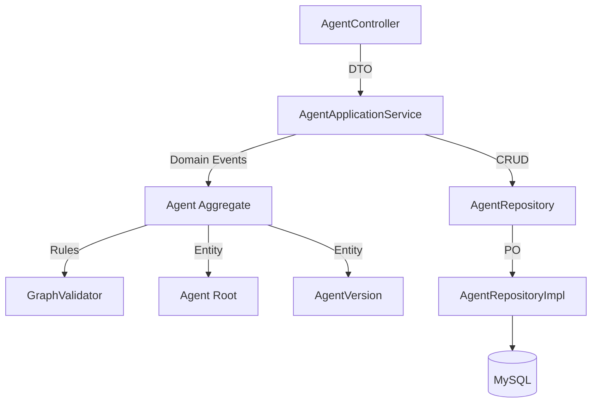

# 设计文档 - Agent 管理与编排模块 (v2.1)

## 1. 概述

Agent 管理模块负责 AI Agent 的全生命周期管理，是支撑域（Supporting Domain）的核心。本设计基于 DDD 架构，旨在实现 Agent 的可视化编排、版本控制、调试闭环等能力。

## 2. 总体架构

### 2.1 模块依赖图



### 2.2 核心设计决策
1.  **读写分离策略**：
    *   **列表页 (Query)**：使用 `findSummaryByUserId`，直接映射 `AgentSummary` DTO，**排除 `graph_json` 字段**。
    *   **详情页/命令 (Command)**：使用 `findById` 加载完整聚合根，包含 `graph_json`。
2.  **并发控制 (Optimistic Locking)**：
    *   引入 `version` 字段。更新操作必须携带前端获取时的 `version`，若数据库版本较新，抛出 `ConcurrentModificationException`。
3.  **版本控制机制**：
    *   **草稿 (Draft)**：用户编辑区，存储在 `agent_info.graph_json`。
    *   **发布 (Publish)**：生成不可变快照存入 `agent_version`。
    *   **回滚 (Rollback)**：读取历史版本快照 -> 覆盖当前草稿 -> (可选) 触发发布。
4.  **调试隔离**：
    *   调试请求不走 `agent_version`，直接读取 `agent_info` 草稿配置。
    *   执行实例标记 `debug_mode=1`，触发全量日志记录 via SSE `debugInfo` 字段。

---

## 3. 领域层设计 (Domain Layer)

### 3.1 聚合根：Agent

```java
public class Agent {
    private Long id;
    private Long userId;
    private String name;
    private String description;
    private String graphJson; // 核心：工作流定义
    private AgentStatus status;
    private Long publishedVersionId;
    private Integer version; // 乐观锁版本号
    
    // --- 核心行为 ---
    
    // 更新配置（带乐观锁校验）
    public void updateConfig(String name, String desc, String newGraph, Integer expectedVersion) {
        if (!this.version.equals(expectedVersion)) {
            throw new ConcurrentModificationException("当前配置已被修改，请刷新页面");
        }
        this.name = name;
        this.description = desc;
        this.graphJson = newGraph;
        // Persistence layer handles version++
    }

    // 发布：校验图结构 -> 生成版本 -> 更新状态
    public AgentVersion publish(GraphValidator validator) {
        validator.validate(this.graphJson); // 校验失败抛出 DomainException
        this.status = AgentStatus.PUBLISHED;
        return new AgentVersion(this.id, this.getNextVersion(), this.graphJson);
    }
    
    // 回滚：将历史版本快照恢复为当前草稿
    public void rollbackTo(AgentVersion version) {
        if (!this.id.equals(version.getAgentId())) {
            throw new IllegalArgumentException("Version mapping error");
        }
        this.graphJson = version.getGraphSnapshot();
        this.status = AgentStatus.DRAFT; 
    }
    
    // 克隆
    public Agent clone(String newName) {
        return new Agent(this.userId, newName, this.graphJson, AgentStatus.DRAFT);
    }
}
```

### 3.2 领域服务：GraphValidator

**类型**：纯内存结构校验 (Structural Validation)。
**实现**：作为 Domain 层的 Utility 类或 Stateless Service。
**注意**：不涉及 DB 查询（如“知识库是否存在”的业务校验由上层 AppService 协调其他模块进行）。

**校验规则**：
1.  **Schema Check**: JSON 结构符合前端定义。
2.  **Entry Point**: 必须包含唯一 `START` 节点。
3.  **Connectivity**: 所有节点从 START 可达。
4.  **No Cycles**: 检测 DAG 无环（拓扑排序算法）。
5.  **Required Config**: 检查节点必填参数。

### 3.3 仓储接口：AgentRepository

```java
public interface AgentRepository {
    // Command / Detail
    void save(Agent agent); 
    Optional<Agent> findById(Long id);
    
    // Query (Lightweight)
    List<AgentSummary> findSummaryByUserId(Long userId);
    
    // Versioning
    void saveVersion(AgentVersion version);
    Optional<AgentVersion> findVersion(Long agentId, Integer version);
    List<AgentVersion> findVersionHistory(Long agentId);
}
```

---

## 4. 应用层设计 (Application Layer)

### AgentApplicationService

| 方法 | 说明 | 事务 | 权限校验 |
| :--- | :--- | :--- | :--- |
| `updateAgent(cmd)` | 更新草稿，**强制**校验版本号 | 开启 | `isOwnedBy(user)` |
| `publishAgent(id)` | 执行发布逻辑 | 开启 | `isOwnedBy(user)` |
| `debugAgent(cmd)` | **SSE 流式响应**。仅当 `cmd.debug=true` 且 Owner 匹配时，推流包含 `debugInfo` | 无 | `isOwnedBy(user)` |

---

## 5. 接口与数据模型

### 5.1 数据模型 (DTO)

**AgentListRespDTO** (列表专用)
```java
{
    Long id;
    String name; 
    Integer status;
    LocalDateTime updateTime;
    // NO graphJson
}
```

**SSE Event Data (Debug 增强)**
```json
{
  "nodeId": "step-1",
  "status": "RUNNING",
  "content": "Thinking...",
  "debugInfo": {  // 仅 debug=true 返回
     "inputs": {"query": "hello"},
     "token_usage": 150,
     "latency_ms": 120
  }
}
```

### 5.2 API 定义

*   `POST /client/agent/copy/{id}`: 克隆 Agent
*   `POST /client/agent/{id}/versions/{version}/rollback`: 版本回滚
*   `POST /client/agent/debug`: 发起调试 (SSE)

---

## 6. 测试策略

### 6.1 核心测试用例
1.  **乐观锁测试**：
    *   线程 A 读取 Agent (v1)。
    *   线程 B 更新 Agent (v1 -> v2)。
    *   线程 A 尝试更新 Agent (v1)，断言抛出 `ConcurrentModificationException`。
2.  **Debug 敏感信息泄露测试**：
    *   普通 `chat` 请求：断言响应中 `debugInfo` 为 null。
    *   `debug` 请求（非 Owner）：断言 403 或 `debugInfo` 为 null。
