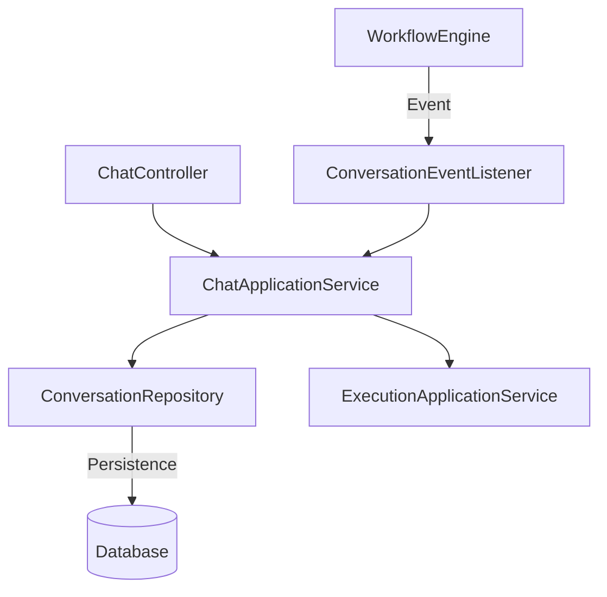

# Design Document - Conversation Context Service

## Overview

Conversation Context 模块负责管理用户与 AI Agent 之间的所有交互历史。它处于架构的支撑域位置，向下对接数据库存储，向上为 Workflow 提供上下文，向外提供 RESTful API 供前端调用。本设计引入了富文本消息结构（思维链、引用、Artifacts），支持高保真 UI 展示。

## Steering Document Alignment

### Technical Standards (ddd-design.md)
- **Domain-Driven Design**:
    - 聚合根：`Conversation`
    - 实体：`Message`
    - 值对象：`ThoughtStep`, `Citation`, `ArtifactReference`, `MessageStatus`
- **Layered Architecture**: 严格遵循 Interface -> Application -> Domain -> Infrastructure 分层。
- **Decoupling**: 通过 Domain Events (`ExecutionCompletedEvent`) 异步解耦消息写入。

### Project Structure (structure.md)
- 代码位置：
    - `ai-agent-domain/src/main/java/com/zj/aiagent/domain/chat`: 领域对象
    - `ai-agent-infrastructure/src/main/java/com/zj/aiagent/infrastructure/chat`: 仓储实现
    - `ai-agent-application/src/main/java/com/zj/aiagent/application/chat`: 应用服务
    - `ai-agent-interfaces/src/main/java/com/zj/aiagent/interfaces/chat`: 控制器

## Code Reuse Analysis

### Existing Components to Leverage
- **Shared Utils**: `Response`, `PageResult` 用于 API 响应标准化。
- **Event Bus**: 利用现有的 Spring Event 机制监听 `ExecutionCompletedEvent`。
- **User Context**: 复用 `UserContext` 获取当前登录用户 ID。

### Integration Points
- **Execution Module**: 监听 `Execution` 完成事件，自动记录 ASSISTANT 消息。
- **Database**: 新增 `conversations` 和 `messages` 表（或 Mongo 集合），建议 MVP 阶段使用 MySQL 存储 JSON 字段 (ThoughtProcess)。

## Architecture



## Components and Interfaces

## Components and Interfaces

### 1. ChatApplicationService (Application Layer)
- **Purpose**: 协调会话管理和消息记录。
- **Interfaces**:
    - `createConversation(userId, agentId)`
    - `getConversationHistory(conversationId, page, size)`
    - `appendUserMessage(conversationId, content)`
    - `initAssistantMessage(conversationId, runId)`: 初始化空消息 (PENDING)，支持流式写入。
    - `finalizeMessage(messageId, content, thoughtProcess, status)`: 更新流式消息为最终状态。
    - `deleteConversation(conversationId)`
- **Dependencies**: `ConversationRepository`, `TransactionTemplate`, `EventPublisher`

### 2. Async Listeners (Event-Driven)
- **ExecutionCompletedListener**: 监听工作流完成，调用 `finalizeMessage` 落库最终结果。
- **AutoTitleListener**: 监听 `MessageAppendedEvent` (或在 Service 埋点)，当会话消息数达到阈值 (如 2 条) 时触发 LLM 标题生成任务。

### 3. ConversationRepository (Domain Interface)
- **Purpose**: 提供领域对象的持久化接口。
- **Interfaces**:
    - `save(Conversation)`
    - `findById(id)`
    - `findByUserIdAndAgentId(conversationId, pageable)`
    - `saveMessage(Message)` 
    - `findMessageById(messageId)`
    - `findMessagesByConversationId(conversationId, pageable)`: 使用 Slice 提升分页性能。

## Data Models

### Domain Model: Conversation (Aggregate Root)
```java
public class Conversation {
    private String id;
    private String userId;
    private String agentId;
    private String title;
    private LocalDateTime createdAt;
    private LocalDateTime updatedAt;
    
    public void updateTitle(String newTitle) {
        this.title = newTitle;
        this.updatedAt = LocalDateTime.now();
    }
}
```

### Domain Model: Message (Entity)
```java
public class Message {
    private String id;
    private String conversationId;
    private MessageRole role; // USER, ASSISTANT
    private String content;   // Markdown
    
    // Rich Features (Map to MySQL JSON)
    // 支持递归结构：ThoughtStep -> children -> ThoughtStep
    private List<ThoughtStep> thoughtProcess; 
    
    private List<Citation> citations;
    
    // 杂项元数据: artifactIds, runId, tokenCount
    private Map<String, Object> metadata;
    
    private MessageStatus status; // PENDING, STREAMING, COMPLETED, FAILED
    private LocalDateTime createdAt;
    
    // Factory method for initiating streaming message
    public static Message initAssistant(String conversationId, String runId) { ... }
}
```

### Value Objects
- **ThoughtStep** (Recursive):
    ```java
    public class ThoughtStep {
        private String stepId;
        private String title;
        private String content;
        private Long durationMs;
        private String status; // RUNNING, SUCCESS, FAILED
        private String type;   // "log", "tool", "parallel_group"
        private List<ThoughtStep> children; // Recursive for nested steps
        private ToolCallDetail toolCall;
    }
    ```
- **Citation**: `{ sourceUrl, sourceName, snippet, pageIndex }`

## Database Schema (MySQL)

**Table: conversations**
| Column | Type | Notes |
|---|---|---|
| id | VARCHAR(64) | PK |
| user_id | VARCHAR(64) | IDX |
| agent_id | VARCHAR(64) | |
| title | VARCHAR(255) | |
| created_at | DATETIME | |
| updated_at | DATETIME | IDX (Sort) |
| is_deleted | TINYINT | Logic Delete |

**Table: messages**
| Column | Type | Notes |
|---|---|---|
| id | VARCHAR(64) | PK |
| conversation_id | VARCHAR(64) | **IDX_conversation_created** (Composite) |
| role | VARCHAR(20) | |
| content | LONGTEXT | |
| thought_process | JSON | Recursive steps structure |
| citations | JSON | References |
| meta_data | JSON | run_id, artifacts, token_count |
| status | VARCHAR(20) | PENDING, COMPLETED, FAILED |
| created_at | DATETIME | **IDX_conversation_created** (Composite) |

## Implementation Steps

1.  **Domain Layer**: 
    - 定义 `Conversation`, `Message` 及递归 VO `ThoughtStep`。
    - 定义 `ConversationRepository` 接口。
2.  **Infrastructure Layer**: 
    - 实现 `JpaConversationRepository`，配置 JPA Converter 处理 JSON 字段。
    - 数据库建表，添加联合索引。
3.  **Application Layer**: 
    - 实现 `ChatApplicationService` (支持 init/finalize 两阶段写入)。
    - 实现 `AutoTitleListener` (自动生成标题逻辑)。
4.  **Interface Layer**: 实现 `ChatController`。
5.  **Integration**: 确保 `Execution` 模块透传 `runId`，用于关联消息。

## Error Handling

1.  **Streaming Interruption**: 若 `initAssistantMessage` 后未收到完成事件（服务崩溃），消息将停留在 `PENDING` 状态。需定时任务清理或在查询时标记为 `ABORTED`。
2.  **JSON Size**: 若 `thought_process` 超过 MySQL JSON 限制 (通常 1GB，够用)，考虑截断日志详情。

## Testing Strategy

- **Recursive JSON Test**: 重点测试多层嵌套 `ThoughtStep` 的 JSON 序列化与反序列化。
- **Streaming State Test**: 模拟 `init` -> `finalize` 流程，验证状态流转。
- **Composite Index**: 验证历史查询 SQL 是否命中 `(conversation_id, created_at)` 索引。
