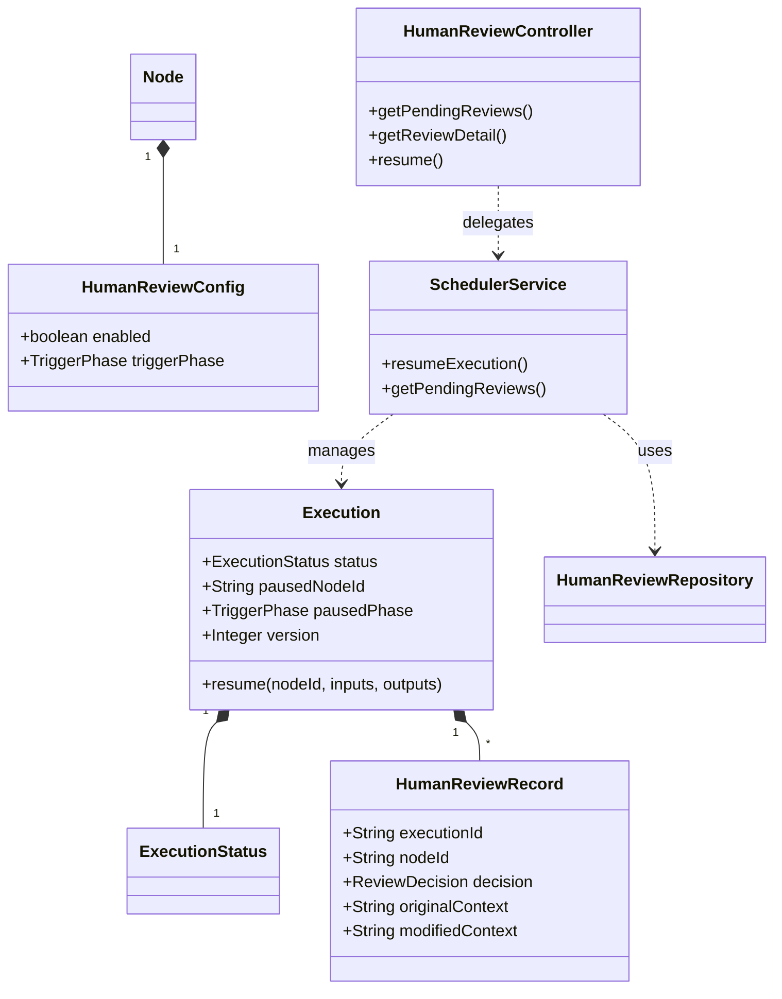

# Human-in-the-Loop Design Document

## Overview

The Human-in-the-Loop feature enables an AI Agent workflow to pause execution at specific nodes, allowing human operators to review, modify, and approve/reject the execution before it proceeds. This design introduces a new `PAUSED_FOR_REVIEW` state, a dedicated `HumanReviewRecord` for audit trails, and a `TriggerPhase` configuration to distinguish between pre-approval (modifying inputs) and post-approval (modifying outputs).

## Steering Document Alignment

### Technical Standards (tech.md)
*   **Domain-Driven Design**: Uses a rich domain model (`HumanReviewRecord` entity, `Execution` aggregate root logic) to encapsulate business rules.
*   **Layered Architecture**: Strictly separates API (Interface), Service (Application), and Entity (Domain) layers.
*   **Immutable Logs**: Audit records are designed as immutable ledger entries.

### Project Structure (structure.md)
*   Entities in `ai-agent-domain/.../entity`
*   Repositories in `ai-agent-infrastructure`
*   Controllers in `ai-agent-interfaces` with DTOs

## Code Reuse Analysis

### Existing Components to Leverage
*   **`Execution` (Aggregate Root)**: Will be extended to handle `reviews` and state transitions.
*   **`SchedulerService`**: Reuse existing node scheduling and locking mechanisms (`Redisson`).
*   **`RedisSseListener`**: Reuse for real-time `workflow_paused` and `workflow_resumed` notifications.
*   **`ExecutorFactory`**: Reuse for resuming execution strategies.

### Integration Points
*   **`ExecutionRepository`**: Will need to persist the new state (`pausedPhase`).
*   **`HumanReviewRepository`**: New integration for storing review logs.

## Architecture



## Components and Interfaces

### Domain Layer

#### `ExecutionStatus` (Enum)
*   **Add**: `PAUSED_FOR_REVIEW (10)`

#### `TriggerPhase` (Enum)
*   **Values**: `BEFORE_EXECUTION`, `AFTER_EXECUTION`

#### `Execution` (Aggregate Root)
*   **Add Field**: `TriggerPhase pausedPhase` (Must be persisted to handle restarts).
*   **Update Logic**: Validation in `resume()` must check `status` AND `pausedNodeId`.

#### `HumanReviewRecord` (Entity)
*   **Fields**: `id`, `executionId`, `nodeId`, `reviewerId`, `decision`, `triggerPhase`, `originalData` (JSON), `modifiedData` (JSON), `comment`, `reviewedAt`.

#### `HumanReviewRepository` (Interface)
*   `save(HumanReviewRecord record)`
*   `findByExecutionId(String executionId)`

### Application Service

#### `SchedulerService`
*   **`checkPause(Execution execution, Node node, TriggerPhase phase)`**:
    *   Determines if execution should pause.
    *   Sets `execution.pausedPhase = phase`.
    *   Publishes `workflow_paused` event (Rich Payload).
*   **`resumeExecution(ResumeCommand cmd)`**:
    *   **Optimistic Lock**: Use Redisson RLock or Lua script to ensure atomic check-and-set of `version`.
    *   **Context Strategy**:
        *   If `pausedPhase == BEFORE_EXECUTION`: Update Node Inputs (merged into context).
        *   If `pausedPhase == AFTER_EXECUTION`: Update Node Outputs (`context.setNodeOutput`).
    *   Persists `HumanReviewRecord`.
    *   Publishes `workflow_resumed` event.

### Interface Layer

#### `HumanReviewController`
*   **`GET /pending-review`**:
    *   **Source**: Query **Redis** (or active `ExecutionRepository`) for Executions with status `PAUSED_FOR_REVIEW`. Do NOT use MySQL audit logs for this (latency/staleness).
    *   Returns lightweight `PendingReviewDTO` list.
*   **`GET /pending-review-detail/{executionId}`**: Returns `ReviewDetailDTO` with full context.
*   **`POST /resume`**: Accepts `ResumeExecutionRequest` (includes version, edits).
*   **`GET /history`**: Returns `HumanReviewRecord` list (Source: MySQL).

## Optimistic Locking Implementation
*   **Mechanism**: Redisson Distributed Lock (`lock:exec:{id}`) + Version Check.
*   **Flow**:
    1.  Acquire Lock.
    2.  Load Execution.
    3.  Check `cmd.version == execution.version`. If not, throw `OptimisticLockingFailureException`.
    4.  Apply changes.
    5.  Save Execution (increment version).
    6.  Release Lock.

## Data Models

### Database Schema (MySQL)

```sql
CREATE TABLE `workflow_human_review_record` (
  `id` bigint NOT NULL AUTO_INCREMENT,
  `execution_id` varchar(64) NOT NULL,
  `node_id` varchar(64) NOT NULL,
  `reviewer_id` bigint NOT NULL,
  `decision` varchar(20) NOT NULL, -- APPROVE, REJECT
  `trigger_phase` varchar(20) NOT NULL, -- BEFORE, AFTER
  `original_data` json DEFAULT NULL, -- Snapshot of Input or Output
  `modified_data` json DEFAULT NULL,
  `comment` varchar(500),
  `reviewed_at` datetime NOT NULL DEFAULT CURRENT_TIMESTAMP,
  PRIMARY KEY (`id`),
  KEY `idx_exec_node` (`execution_id`, `node_id`),
  KEY `idx_reviewer` (`reviewer_id`) -- For history queries
);
```

## SSE Notifications

### Payloads

**Paused**:
```json
{
  "type": "workflow_paused",
  "executionId": "exec-123",
  "nodeId": "node-001",
  "triggerPhase": "AFTER_EXECUTION",
  "timestamp": 1705046400000
}
```

**Resumed**:
```json
{
  "type": "workflow_resumed",
  "executionId": "exec-123",
  "timestamp": 1705046500000
}
```

## Testing Strategy

### Unit Testing
*   **`ExecutionTest`**: Verify `pausedPhase` persistence and restoring.
*   **`SchedulerServiceTest`**: Verify Context merging strategy (Input vs Output) based on phase.

### Integration Testing
*   **Race Condition**: Simulate concurrent Resume requests with same version -> ensure only one succeeds.
