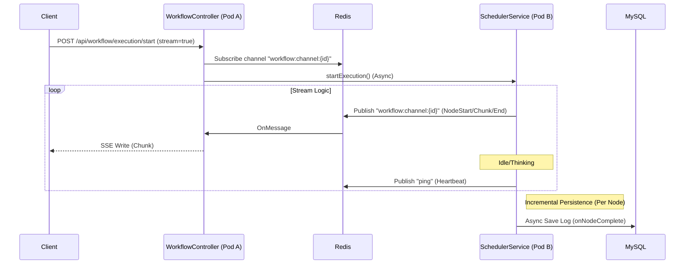

# AI-Agent Intelligent Chat Module - Design Document

## 1. Overview
The **Intelligent Chat Module** enables real-time interaction between users and the AI Agent workflow. It leverages **Server-Sent Events (SSE)** to stream execution progress, supports a "Thinking" mode for visualization of complex reasoning, and provides a **Debug Mode** for detailed execution tracing.

## 2. Architecture

### 2.1 Component Interaction
1.  **Client (React)**: Initiates chat, listens to SSE stream, renders messages/thoughts/debug info.
2.  **WorkflowController**: Handles HTTP requests (`POST /start`, `GET /history`), manages SSE emitters.
3.  **SseEventPublisher**: Listens to Domain Events (`NodeStarted`, `NodeCompleted`) and pushes formatted SSE events to the Controller.
4.  **WorkflowNodeExecutionLogRepository**: MySQL persistence for detailed execution logs (Audit Log).
5.  **SchedulerService**: Executes the DAG and publishes Domain Events (already implemented).

### 2.2 Data Flow


## 3. Data Models

### 3.1 Database Schema (MySQL)

**Table: `workflow_node_execution_log`**
Used for history and debug details.

```sql
CREATE TABLE workflow_node_execution_log (
    id BIGINT AUTO_INCREMENT PRIMARY KEY,
    execution_id VARCHAR(64) NOT NULL,
    node_id VARCHAR(64) NOT NULL,
    node_name VARCHAR(128),
    node_type VARCHAR(32),
    render_mode VARCHAR(32) NOT NULL COMMENT 'HIDDEN, THOUGHT, MESSAGE',
    status TINYINT NOT NULL COMMENT '0:Running, 1:Success, 2:Failed',
    inputs JSON, -- Full inputs (sensitive data included)
    outputs JSON, -- Full outputs
    error_message TEXT,
    start_time DATETIME(3),
    end_time DATETIME(3),
    INDEX idx_execution_id (execution_id)
);
```

### 3.2 Value Objects (Java)

**`RenderConfig`**
```java
public class RenderConfig {
    private String mode; // HIDDEN, THOUGHT, MESSAGE
    private String title; // "Thinking...", "Searching..."
}
```

**`SseEventPayload`**
```java
public class SseEventPayload {
    private String executionId;
    private String nodeId;
    private String nodeType;
    private long timestamp;
    private RenderConfig renderConfig;
    
    // Content structure
    private boolean isThought; // true: Update thought block, false: Update main message
    private String content;    // Delta text content
    private Object data;       // For debug inputs/outputs or JSON data
}
```

## 4. API Design

### 4.1 SSE Stream (Combined)
*   **Method**: `POST /api/workflow/execution/start`
*   **Content-Type**: `text/event-stream`
*   **Description**: Initiates workflow and immediately returns the SSE stream. Holds connection open.
    *   **Note**: This replaces the split `/start` + `/stream` approach to avoid race conditions.
*   **Mechanism**:
    1.  Generate `executionId` immediately.
    2.  Subscribe `SseEmitter` to Redis channel `workflow:channel:{executionId}`.
    3.  Async call scheduler to start execution.
    4.  Stream events as they arrive from Redis.
    5.  **Timeout**: Set `SseEmitter` timeout to `1800000L` (30 mins) to support long-running nodes.
    6.  Handle timeouts with auto-ping.

### 4.2 Control API
*   `POST /api/workflow/execution/stop`
    *   **Body**: `{ "executionId": "..." }`
    *   **Description**: Interrupts a running execution. Sets status to CANCELLED in Redis/DB; Scheduler checks this flag before next node.

### 4.3 History API
*   `GET /api/workflow/execution/history/{conversationId}`
    *   Response: List of previous executions/messages.
*   `GET /api/workflow/execution/{executionId}/node/{nodeId}`
    *   Response: Full `inputs` and `outputs` from MySQL (for Debug Mode).

## 5. Security & Visibility

### 5.1 Visibility Logic
In `SseEventPublisher`:
```java
if (!debugMode && config.getVisibility() == HIDDEN) {
    return; // Do not push event
}
if (!debugMode) {
    // Mask sensitive inputs/outputs
    payload.setInputs(null); 
    payload.setOutputs(filterPublicOutputs(result.getOutputs()));
}
```

## 6. Implementation Steps
1.  **Infrastructure**: Add Redis Pub/Sub config (`MessageListenerAdapter`, `RedisMessageListenerContainer`).
2.  **Domain**: Update `SseEventPayload` with `isThought` and `content`.
3.  **Infrastructure**: Implement `RedisSsePublisher` (sends to Redis) and `RedisSseSubscriber` (pushes to Emitter).
4.  **Application**: Update `SchedulerService` to support cancellation check.
5.  **Interface**: Refactor `WorkflowController` to support Direct POST Streaming.
