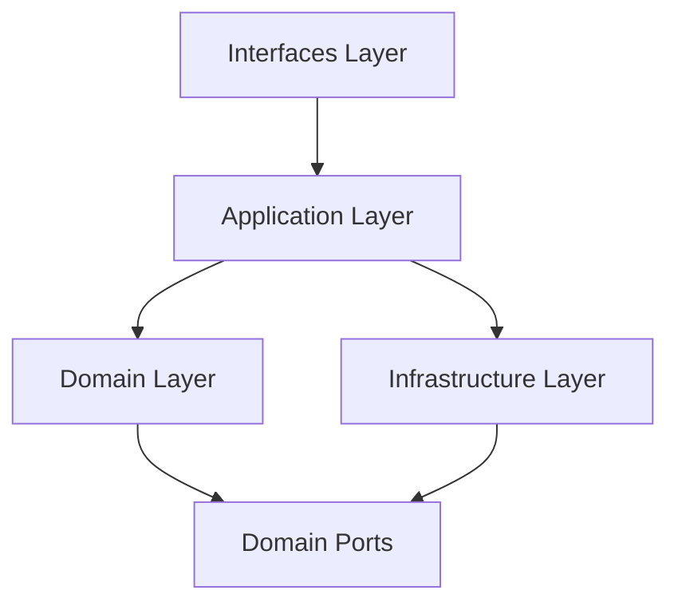

# 设计文档

## 概述

**用户认证模块** 采用领域驱动设计 (DDD) 架构，作为通用的支撑域（Generic Domain）。它负责处理所有与用户身份相关的逻辑，包括注册、登录、会话管理和安全防护，对外提供标准的 REST API 和内部 Java 接口。

## 架构设计

### 分层架构

本模块遵循洋葱架构/六边形架构原则：

- **接口层 (Interfaces)**: 处理 HTTP 请求 (`UserController`)，参数校验，DTO 转换。
- **应用层 (Application)**: 编排业务流程 (`UserApplicationService`)，不包含核心业务规则，只负责协调领域服务和基础设施。
- **领域层 (Domain)**: 包含核心业务逻辑。
    - **聚合根**: `User` (管理密码、状态、个人信息)。
    - **值对象**: `Email` (校验逻辑), `Credential` (加密逻辑)。
    - **领域服务**: `UserAuthenticationDomainService` (核心认证流程)。
    - **限流策略**: 采用工厂模式 (`RateLimiterFactory`) 管理多种限流算法实现。目前仅实现 `SlidingWindowRateLimiter`。
- **基础设施层 (Infrastructure)**: 实现技术细节。
    - **Repository**: `UserRepositoryImpl` (MyBatis-Plus 实现)。
    - **Port Impl**: `EmailServiceImpl`, `RedisTokenStore`, `RedisSlidingWindowRateLimiter`。

### 模块依赖


## 组件与接口设计

### 1. 接口层 (REST API)

| 方法 | 路径 | 描述 | 请求 DTO | 响应 DTO |
|------|------|------|----------|----------|
| POST | `/client/user/email/sendCode` | 发送验证码 | `SendEmailCodeRequest` | `Void` |
| POST | `/client/user/email/register` | 邮箱注册 | `RegisterByEmailRequest` | `UserLoginResponse` |
| POST | `/client/user/login` | 用户登录 | `LoginRequest` | `UserLoginResponse` |
| GET | `/client/user/info` | 获取用户信息 | - | `UserDetailDTO` |
| POST | `/client/user/modify` | 修改用户信息 | `ModifyUserRequest` | `UserDetailDTO` |
| POST | `/client/user/logout` | 用户登出 | - | `Void` |

### 2. 应用层服务 (`UserApplicationService`)

- `registerByEmail(cmd)`: 协调 `EmailVerificationDomainService` 验证验证码，调用 `UserAuthenticationDomainService` 创建用户，最后调用 `TokenService` 生成令牌。
- `login(cmd)`: 调用 `AuthenticationDomainService` 验证凭据，成功后生成令牌。
- `modifyInfo(cmd)`: 调用 `User` 聚合根更新信息，并持久化。

### 3. 领域层模型 (`Domain Model`)

#### User 聚合根
```java
public class User {
    private UserId id;
    private String username;
    private Email email;
    private Credential credential;
    private UserProfile profile; // 头像, 手机号等
    
    // 行为方法
    public void changePassword(String oldPwd, String newPwd);
    public void updateProfile(String newName, String newAvatar, String newPhone);
    public boolean verifyPassword(String rawPassword);
}

#### 限流策略设计 (Factory Pattern)

为了支持未来的算法扩展（如令牌桶、漏桶），采用工厂模式创建限流器。

```java
// 策略接口
public interface RateLimiter {
    boolean tryAcquire(String key, int limit, int periodSeconds);
}

// 具体策略实现
public class SlidingWindowRateLimiter implements RateLimiter {
    // 基于 Redis Lua 脚本实现滑动窗口
}

// 工厂类
public class RateLimiterFactory {
    public static RateLimiter getRateLimiter(String type) {
        if ("SLIDING_WINDOW".equals(type)) {
            return new SlidingWindowRateLimiter();
        }
        // 后续可扩展 TOKEN_BUCKET 等
        throw new IllegalArgumentException("Unknown rate limiter type");
    }
}
```

## 数据模型设计

### 数据库 Schema

引用 `库表设计.md` 中的 `user_info` 表设计。

```sql
CREATE TABLE IF NOT EXISTS `user_info` (
    `id` BIGINT NOT NULL AUTO_INCREMENT COMMENT '用户ID',
    `username` VARCHAR(50) NOT NULL COMMENT '用户名',
    `email` VARCHAR(100) NOT NULL COMMENT '邮箱地址（登录账号）',
    `password` VARCHAR(255) NOT NULL COMMENT 'BCrypt加密密码',
    `phone` VARCHAR(20) DEFAULT NULL COMMENT '手机号',
    `avatar_url` VARCHAR(500) DEFAULT NULL COMMENT '头像URL',
    `status` TINYINT NOT NULL DEFAULT 1 COMMENT '状态：0-禁用，1-正常',
    `last_login_ip` VARCHAR(50) DEFAULT NULL COMMENT '最后登录IP',
    `last_login_time` DATETIME DEFAULT NULL COMMENT '最后登录时间',
    `deleted` TINYINT NOT NULL DEFAULT 0 COMMENT '逻辑删除：0-正常，1-已删除',
    `created_at` DATETIME NOT NULL DEFAULT CURRENT_TIMESTAMP COMMENT '创建时间',
    `updated_at` DATETIME NOT NULL DEFAULT CURRENT_TIMESTAMP ON UPDATE CURRENT_TIMESTAMP COMMENT '更新时间',
    PRIMARY KEY (`id`),
    UNIQUE KEY `uk_email` (`email`)
) ENGINE=InnoDB DEFAULT CHARSET=utf8mb4 COLLATE=utf8mb4_unicode_ci COMMENT='用户信息表';
```

## 安全与异常处理

### 安全策略
1.  **密码存储**: 必须使用 BCrypt 强哈希算法（Spring Security Crypto）。
2.  **Token 管理**: 使用 JWT (JWS)，包含 `sub` (userId), `exp` (过期时间), `jti` (唯一ID)。
3.  **并发控制**: 注册时使用数据库唯一索引防止邮箱重复。
4.  **限流**: 使用 `RateLimiterFactory` 获取限流实例。当前版本默认使用 Redis `INCR` + `EXPIRE` (或 Lua 脚本) 实现的 **滑动窗口** 算法。

### 异常处理
*   `UserAlreadyExistsException` -> 409 Conflict
*   `InvalidCredentialException` -> 401 Unauthorized (对外显示 generic message)
*   `RateLimitExceededException` -> 429 Too Many Requests
*   `ValidationException` -> 400 Bad Request

## 测试策略

### 单元测试
*   **Domain**: 测试 `User` 聚合根的行为（如修改信息逻辑）、`Email` 值对象验证。
*   **Service**: Mock Repository，测试 `UserAuthenticationDomainService` 的业务流。

### 集成测试
*   **Controller**: 使用 `@SpringBootTest` + `MockMvc` 测试完整的 HTTP 请求流程，验证 JSON 序列化和状态码。
*   **Repository**: 使用 H2 或 Testcontainers 验证 SQL 执行正确性。
