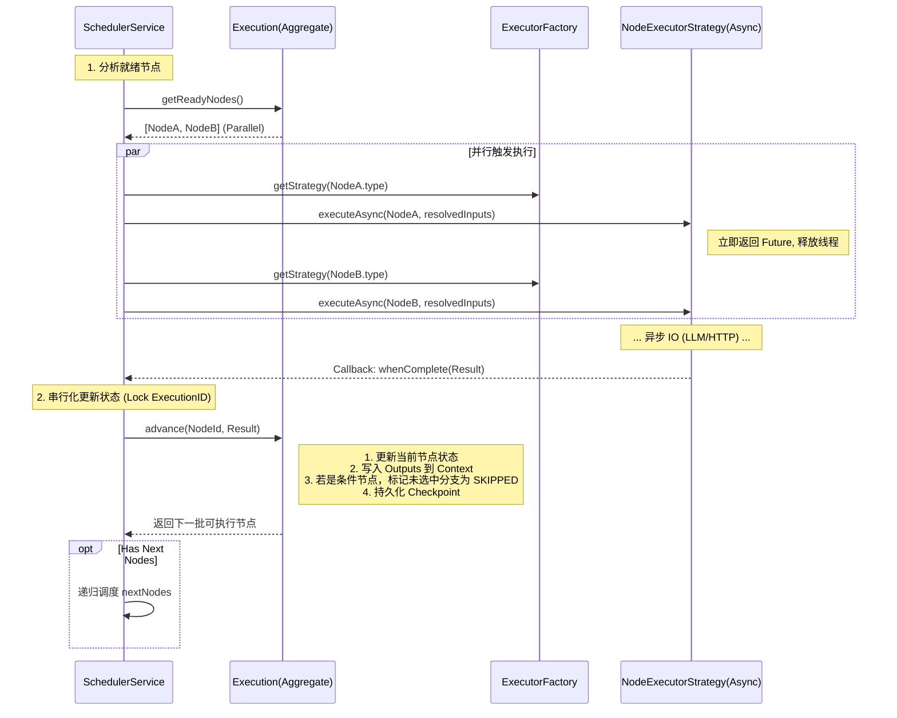

# 设计文档 - 工作流编排模块 (Orchestration Context) v3.3

## 概述

工作流编排模块（Core Domain）采用 **领域驱动设计 (DDD)** 构建，核心是 `Execution` 聚合根。其主要职责是解析 `WorkflowGraph`，依据拓扑结构调度 `Node`，并通过 **异步策略模式** 委托基础设施层执行具体业务逻辑。本设计重点解决 **异步非阻塞**、**并发状态一致性** 和 **条件分支剪枝** 等核心架构挑战。

## 架构设计

### 核心设计原则
1.  **异步非阻塞 (Async Non-Blocking)**: 节点执行采用 `CompletableFuture` 并在此时释放调度线程，防止长时间占用资源。
2.  **串行化状态更新 (Serialized State Update)**: 虽然执行是并行的，但聚合根的状态变更 (`advance`) 必须通过**分布式锁**或**Actor队列**强制串行化，防止数据竞争。
3.  **明确的调度逻辑**: 调度器负责“推”模型——计算入度 -> 触发执行 -> 等待回调 -> 剪枝未选中分支 -> 触发后续。

### 架构交互图



## 组件与接口详情

### 1. NodeExecutorStrategy (策略接口 - 异步改造)
**位置**: `com.zj.aiagent.domain.workflow.port`

```java
public interface NodeExecutorStrategy<T extends NodeConfig> {
    /**
     * 异步执行节点逻辑
     * @param node 节点配置
     * @param inputVariables 经过 SpEL 解析后的具体输入参数
     * @return 包含输出和控制流信息的 Future
     */
    CompletableFuture<NodeExecutionResult> executeAsync(Node node, Map<String, Object> inputVariables);
    
    NodeType getSupportedType();
}

/**
 * 线程池配置 (Infrastructure Layer)
 * 必须使用独立的 IO 密集型线程池，避免阻塞 ForkJoinPool.commonPool
 */
@Bean("nodeExecutorThreadPool")
public Executor nodeExecutorThreadPool() {
    ThreadPoolTaskExecutor executor = new ThreadPoolTaskExecutor();
    executor.setCorePoolSize(20); // 核心线程数
    executor.setMaxPoolSize(100); // 最大线程数
    executor.setQueueCapacity(200);
    executor.setThreadNamePrefix("wf-exec-");
    return executor;
}

@Data
public class NodeExecutionResult {
    private ExecutionStatus status; // SUCCEEDED, FAILED
    private Map<String, Object> outputs;
    private String selectedBranchId; // 仅 Condition 节点返回，用于剪枝
}
```

### 2. SchedulerService (逻辑增强)
**职责**:
1.  **异步回调管理**: 使用 `CompletableFuture.whenComplete` 监听执行结果。
2.  **SpEL 预解析 (Input Mapping)**: 在调用 `executeAsync` 前，利用 `ExecutionContext.resolve(inputs)` 将配置的表达式解析为值。
3.  **并发控制**: 在回调方法中，必须对 `executionId` 加 **Redis 分布式锁 (Redisson)**，确保同一 Agent 的状态更新是分布式的原子操作。

### 3. Execution (聚合根 - 状态逻辑)
**核心方法 `advance(nodeId, result)`**:
1.  **Update Self**: 将当前节点状态置为 `SUCCEEDED`，将 `result.outputs` 写入全局 Context。
2.  **Branch Pruning (剪枝)**:
    *   若当前是 `CONDITION` 节点，读取 `result.selectedBranchId`。
    *   遍历其余分支的下游节点，递归将其状态置为 `SKIPPED`，直到遇到汇聚点（Join Node）。
3.  **Next Nodes**: 计算剩余节点的由入度（In-Degree），返回 `inDegree == 0` 的节点列表。
    *   **菱形汇聚逻辑**: 对于 Join 节点，若父节点状态为 `SKIPPED`，应视为依赖已满足（等同于 SUCCEEDED），防止死锁。

## 数据流与状态管理

### SpEL 解析时机
1.  **Input Mapping (Pre-Execution)**: 
    *   在 **SchedulerService** 中完成。
    *   从 `ExecutionContext` 读取原始数据，解析 NodeConfig 中的 `${input.query}`，生成 `Map<String, Object> resolvedInputs` 传给 Executor。
    *   *优势*: Executor 不需要依赖 SpEL 引擎，保持纯粹。
2.  **Output Mapping (Post-Execution)**:
    *   在 **Execution.advance()** 中完成。
    *   将 `NodeExecutionResult.outputs` 这里面的 Raw Data 存入 Context。

### 大对象处理 (Large Object Handling)
*   **Context 瘦身**: `ExecutionContext` 不应存储大段文本或文件二进制。
*   **引用传递**: 建议 LLM 生成的长文本上传到 S3/OSS，Context 中只存 `ref://bucket/key` 或 URL。Executor 需要支持自动解引（Future Scope）。

## 健壮性设计

### 并发冲突解决
*   **问题**: 多实例部署，节点 A 和 B 同时完成，同时调 `advance`。
*   **解法**: `SchedulerService` 在处理回调时使用 Redisson：
    ```java
    RLock lock = redissonClient.getLock("lock:exec:" + executionId);
    try {
        lock.lock(5, TimeUnit.SECONDS);
        Execution execution = repository.load(executionId);
        List<Node> next = execution.advance(nodeId, result); // 包含 Join 逻辑
        repository.save(execution); // 乐观锁版本检查
        schedule(next);
    } finally {
        lock.unlock();
    }
    ```

### 循环检测
*   **Design Time**: Agent 发布时强制检测。
*   **Runtime**: `Execution` 内部维护 `executedNodeIds` Set，若调度到已执行过的节点（且非 Loop 结构），抛出异常。

## 测试策略

### 并发测试
*   构造一个 `PARALLEL` 节点，连接 10 个 `SynthenticDelayNode`（模拟耗时操作）。
*   验证 10 个节点是否**同时**启动（日志时间戳接近）。
*   验证 10 个回调是否**串行**更新状态（最终 Context 包含所有 10 个节点的输出，无覆盖丢失）。

### 分支剪枝测试
*   构造 `Condition` -> (Branch A, Branch B) -> Join。
*   Mock 策略返回 Branch A。
*   验证 Branch B 的节点状态变为 `SKIPPED`，Join 节点能正确被激活（不被 B 的未完成状态阻塞）。
