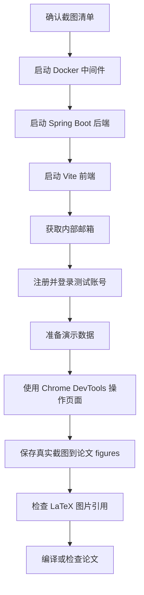

# 论文真实系统运行截图替换计划

## 选中的模块 + 已加载的模块 AGENT 列表

- 选中的模块：User/Auth、Agent、Workflow、Review、Knowledge、Chat
- 已加载的模块 AGENT 列表：
  - [`ai-agent-foward/src/modules/auth/AGENT.md`](../../ai-agent-foward/src/modules/auth/AGENT.md)
  - [`ai-agent-foward/src/modules/agent/AGENT.md`](../../ai-agent-foward/src/modules/agent/AGENT.md)
  - [`ai-agent-foward/src/modules/workflow/AGENT.md`](../../ai-agent-foward/src/modules/workflow/AGENT.md)
  - [`ai-agent-foward/src/modules/review/AGENT.md`](../../ai-agent-foward/src/modules/review/AGENT.md)

## 已确认的上下文

- 论文入口为 [`论文/main.tex`](../../论文/main.tex)，正文通过 `\include{chapter/...}` 引入章节。
- 当前真正需要替换为真实运行截图的主要图片集中在 [`论文/chapter/ch4_implementation.tex`](../../论文/chapter/ch4_implementation.tex)：
  - `fig_auth_ui.png`：用户认证界面
  - `fig_agent_editor.png`：Agent 可视化编排界面
  - `fig_agent_list.png`：Agent 列表与版本管理界面
  - `fig_wf_exec.png`：工作流执行界面
  - `fig_wf_log.png`：执行思维链日志
  - `fig_review_panel.png`：人工检查点审批界面
  - `fig_resume_ui.png`：审批通过后工作流恢复执行界面
  - `fig_knowledge_ui.png`：知识库管理界面
  - `fig_sse_ui.png`：SSE 实时推流前端展示
- 需求、设计类图像还包括 [`论文/chapter/ch2_requirements.tex`](../../论文/chapter/ch2_requirements.tex) 与 [`论文/chapter/ch3_design.tex`](../../论文/chapter/ch3_design.tex) 中的架构图、用例图、状态机图等，这些属于设计图，不一定需要用系统截图替换。
- 前端入口与路由见 [`ai-agent-foward/src/app/router.tsx`](../../ai-agent-foward/src/app/router.tsx)：
  - `/login`
  - `/register`
  - `/dashboard`
  - `/agents`
  - `/agents/:agentId/workflow`
  - `/knowledge`
  - `/chat`
  - `/reviews`
- 前端启动命令见 [`ai-agent-foward/package.json`](../../ai-agent-foward/package.json)：`npm run dev`，Vite 默认访问 `http://localhost:5173`。
- 前端代理见 [`ai-agent-foward/vite.config.ts`](../../ai-agent-foward/vite.config.ts)，`/api` 与 `/client` 转发到 `http://localhost:8080`。
- 后端启动命令见 [`CLAUDE.md`](../../CLAUDE.md)：`mvn spring-boot:run -pl ai-agent-interfaces -Dspring-boot.run.profiles=local`。
- 本地配置见 [`ai-agent-interfaces/src/main/resources/application-local.yml`](../../ai-agent-interfaces/src/main/resources/application-local.yml)，后端端口为 `8080`，MySQL 为 `localhost:13306`，Redis 为 `127.0.0.1:6379`，Milvus 为 `localhost:19530`。
- 中间件启动见 [`docker/docker-compose.yml`](../../docker/docker-compose.yml) 与 [`docker/README.md`](../../docker/README.md)，包含 MySQL、Redis、MinIO、etcd、Milvus。

## 执行流程图

## 截图替换策略

优先覆盖同名文件，减少修改 LaTeX 正文的风险：

| 目标文件 | 页面或操作来源 | 说明 |
|---|---|---|
| `论文/figures/fig_auth_ui.png` | `/login` 或 `/register` | 截取真实登录或注册界面 |
| `论文/figures/fig_agent_list.png` | `/agents` | 截取 Agent 列表、状态、版本管理入口 |
| `论文/figures/fig_agent_editor.png` | `/agents/:agentId/workflow` | 截取流程编排画布、节点配置面板 |
| `论文/figures/fig_wf_exec.png` | `/chat` 或工作流执行页交互 | 截取工作流执行中的运行状态 |
| `论文/figures/fig_wf_log.png` | `/chat` 执行详情或日志区域 | 截取节点日志、思考过程或执行轨迹 |
| `论文/figures/fig_review_panel.png` | `/reviews` 或审核弹窗 | 截取待审核记录与审批操作 |
| `论文/figures/fig_resume_ui.png` | 审批通过后的执行恢复界面 | 截取恢复执行后的状态变化 |
| `论文/figures/fig_knowledge_ui.png` | `/knowledge` | 截取知识库数据集与文档管理界面 |
| `论文/figures/fig_sse_ui.png` | `/chat` 流式响应过程 | 截取 SSE 实时输出或流式进度 |

## 计划步骤

1. 在 Code 模式加载用户指定的内部邮箱技能路径 `/home/zj669/repo/skills/internal-mailbox`，获取可注册邮箱与验证码读取方式。
2. 启动基础设施：在 `docker/` 下运行 `docker compose up -d` 或兼容的 `docker-compose up -d`。
3. 等待 MySQL、Redis、MinIO、Milvus 健康后，启动后端：`mvn spring-boot:run -pl ai-agent-interfaces -Dspring-boot.run.profiles=local`。
4. 启动前端：在 `ai-agent-foward/` 下运行 `npm install` 如依赖缺失，再运行 `npm run dev`。
5. 打开 Chrome DevTools 浏览器到 `http://localhost:5173/register`，用内部邮箱注册账号并读取验证码。
6. 登录后准备最小演示数据：
   - 创建至少一个 Agent。
   - 进入流程编排画布，添加可展示节点与连线，保存或发布。
   - 如需审批截图，配置能触发人工审核的工作流或使用已有测试数据。
   - 创建知识库数据集，必要时上传一个小型测试文档。
7. 按截图清单逐页操作真实功能，使用 Chrome DevTools `take_screenshot` 保存到 `论文/figures/`，优先覆盖同名图片。
8. 对截图做必要的裁剪或全页/视口选择，确保论文中缩放后仍能看清关键 UI。
9. 检查 [`论文/chapter/ch4_implementation.tex`](../../论文/chapter/ch4_implementation.tex) 的 `\includegraphics` 路径无需变更；如生成了新文件名，则同步修改对应引用。
10. 编译或至少执行 LaTeX 图片路径检查，确认 [`论文/main.tex`](../../论文/main.tex) 可正常引用图片。

## 需要用户确认的点

- 是否仅替换第 4 章实现部分的 UI 截图，保留第 2、3 章的用例图、架构图、流程图和状态机图。
- 是否允许在 Code 模式实际启动 Docker、后端、前端，并用 Chrome DevTools 进行注册、登录和截图。
- 是否优先覆盖原有同名图片文件，而不是修改 LaTeX 引用文件名。
