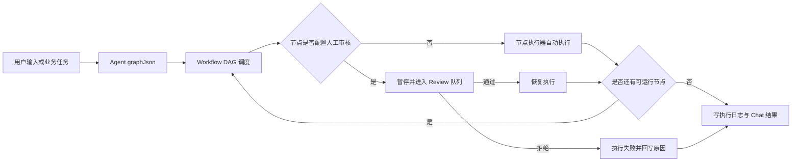

# AI Agent Platform

## 项目定位

这是一个面向真实业务流程的 AI 执行平台。当前代码实现的核心不是单次问答，而是把 Agent 配置、工作流编排、流式执行、人工审核、知识库检索、模型配置、MCP 工具和多 Agent 写作协作放在同一条业务闭环中。

一句话概括：让 AI 流程既能自动执行，也能在关键节点被人工管控，并保留完整执行轨迹。

## 当前代码已落地的能力

1. Agent 管理：创建、更新、发布、回滚、版本快照和逻辑删除。
2. 工作流执行：基于 `graphJson` 解析 DAG，支持 `START / END / LLM / HTTP / KNOWLEDGE / CONDITION / TOOL` 节点。
3. 流式响应：工作流执行通过 SSE 推送连接、节点开始、增量输出、暂停、完成和错误事件。
4. 人工审核：节点可配置 `BEFORE_EXECUTION` 或 `AFTER_EXECUTION` 审核闸门，审核通过后恢复，拒绝后终止。
5. Chat 联动：前端聊天页当前直接启动 `/api/workflow/execution/start`，由调度器落库用户消息、初始化 assistant 消息并回写最终结果。
6. 知识库：支持数据集、文档上传、异步解析分块、MinIO 文件存储、Milvus 向量写入与检索；未启用 Milvus 时有 No-Op 适配器。
7. LLM 配置：用户级模型配置 CRUD、默认配置切换和连通性测试；接口返回不会暴露 API Key。
8. MCP 工具：支持 MCP server 配置、连接、断开、工具发现和工作流 TOOL 节点调用。
9. Swarm / Writing：支持多 Agent 工作空间、群组消息、SSE 事件、动态创建 Worker、任务派发、结果提交和写作 overview 聚合。
10. Dashboard：按用户聚合 Agent、Conversation、Knowledge、Workflow 执行统计，并带 Redis/Redisson 缓存。

## 代码结构

| 模块 | 说明 |
|------|------|
| `ai-agent-shared` | 公共响应、上下文、工具与共享抽象 |
| `ai-agent-domain` | 领域实体、值对象、领域服务、仓储接口、端口定义 |
| `ai-agent-application` | 应用服务与用例编排，包含 workflow 调度、chat、knowledge、swarm、writing 等编排逻辑 |
| `ai-agent-infrastructure` | MyBatis Plus、Redis、Milvus、MinIO、MCP、Spring AI、SSE 等技术适配 |
| `ai-agent-interfaces` | Spring Boot 入口、REST Controller、拦截器、配置与异常处理 |
| `ai-agent-foward` | Vite + React 前端，包含 Agent、Workflow、Chat、Review、Knowledge、LLM、MCP、Swarm 等页面模块 |

当前代码并不是严格的“application 只依赖 domain”的纯净 DDD 依赖方向：`ai-agent-application` 的 Maven 配置直接依赖了 `ai-agent-infrastructure`。写文档或做架构判断时应以当前 `pom.xml` 为准。

## 核心业务闭环



## 主要 HTTP 入口

| 能力 | 路径 |
|------|------|
| 用户认证 | `/client/user` |
| Agent 管理 | `/api/agent` |
| 工作流执行 | `/api/workflow/execution` |
| 人工审核 | `/api/workflow/reviews` |
| Chat 会话 | `/api/chat` |
| 知识库 | `/api/knowledge` |
| 节点元数据 | `/api/meta` |
| Dashboard | `/api/dashboard` |
| LLM 配置 | `/api/llm-config` |
| MCP | `/api/mcp` |
| Swarm | `/api/swarm/*` |
| Writing overview | `/api/writing` |

## 本地开发入口

后端默认端口：`8080`。前端 Vite 默认端口：`5173`，并把 `/api` 与 `/client` 代理到后端。

后端改动后，推荐先安装 reactor 模块再启动：

```bash
./mvnw clean install -pl ai-agent-interfaces -am -Dmaven.test.skip=true
./mvnw spring-boot:run -pl ai-agent-interfaces -Dspring-boot.run.profiles=local -Dmaven.test.skip=true
```

前端：

```bash
cd ai-agent-foward
npm install
npm run dev
```

## 文档阅读顺序

1. [docs/PROJECT_QUICK_CONTEXT.md](docs/PROJECT_QUICK_CONTEXT.md)
2. [docs/api/backend-api-overview.md](docs/api/backend-api-overview.md)
3. 具体模块 API 文档：`docs/api/*.md`
4. 当前代码蓝图：`.blueprint/README.md`

历史 PRD、bugfix-log 和探索文档保留了当时的设计/排查上下文，不一定代表当前实现。判断当前行为时优先看代码、控制器、初始化 SQL 和上述入口文档。
