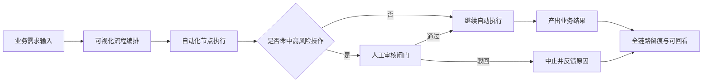

# AI Agent Platform

## 项目一句话定位
这是一个面向真实业务流程的 AI 执行平台：让流程不再是“黑盒自动跑完”，而是“可编排、可审批、可追溯”。

## 为什么要做这个项目
我们在实际业务中反复看到同一个问题：团队可以很快把流程拖拉拽出来，但一旦流程进入执行阶段，关键环节往往缺少人工把关。  
尤其是涉及高风险动作时，如果没有审批闸门，业务负责人不放心放开执行，技术团队也难以给出可追责的保障。

我们不希望只做一个“能跑起来”的自动化系统，而是希望做一个“业务敢用”的执行系统。

## 我们在解决什么问题
1. 复杂任务协作低效，流程从设计到落地经常断层。
2. 执行过程缺少审批机制，高风险动作无法安全落地。
3. 结果可见但过程不可见，复盘和责任界定成本高。

## 我们做了什么
1. 提供可视化流程编排能力，让业务流程可以被明确表达和持续迭代。
2. 在流程执行中引入人工审核节点，让关键操作具备“先审后执行”的安全闸门。
3. 支持执行过程可中断、可恢复，让自动化与人工决策可以自然协同。
4. 保留全链路执行记录，便于复盘、审计与责任追踪。
5. 打通从需求输入到结果输出的完整闭环，减少跨角色沟通损耗。

## 当前业务流程架构图

## 一次完整业务闭环示例
1. 团队先把业务流程配置为可执行的节点链路。
2. 用户发起任务后，系统按流程自动推进。
3. 当执行到高风险节点时，系统自动暂停并进入人工审核。
4. 审核通过则继续执行，审核驳回则终止并返回原因。
5. 最终输出业务结果，同时沉淀完整执行轨迹用于复盘。

## 现在已经达到什么程度
当前项目处于 MVP 可演示阶段，已经打通“流程编排 -> 执行 -> 审核 -> 继续/终止 -> 结果回看”的核心主链路，可用于场景演示和流程验证。

## 适用场景与价值
1. 需要在自动化执行中保留人工决策权的业务场景。
2. 对执行安全性、可追溯性有明确要求的团队。
3. 希望缩短“流程设计”到“业务落地”周期的组织。

核心价值是：在保证效率的同时，建立可控、可信、可复盘的执行体系。

## 结语
我们相信，真正可落地的 AI 流程平台，不是追求“全自动”，而是把自动化能力与人的判断力放在同一条闭环里。
