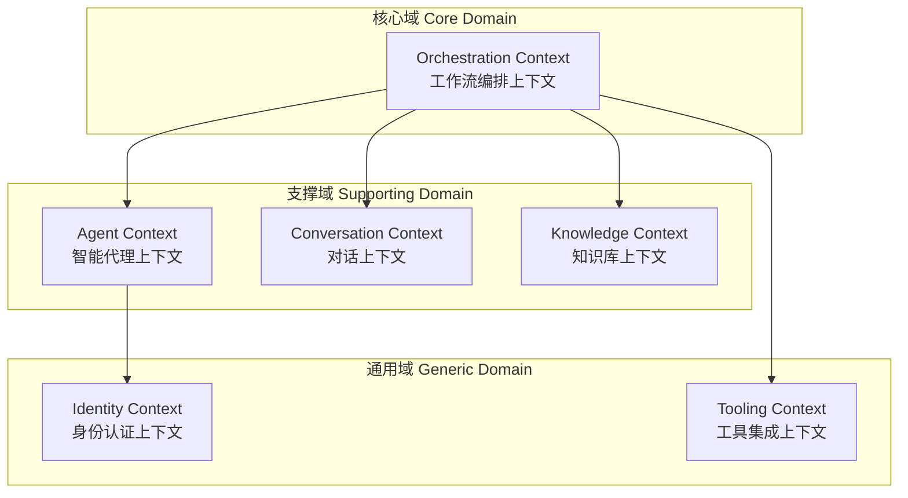
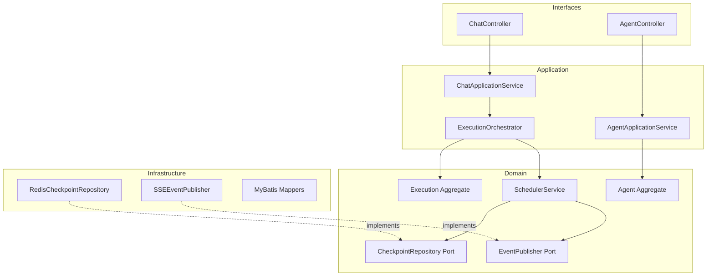

# AI-Agent 项目 DDD 领域驱动设计文档

## 目录

1. [项目概述](#项目概述)
2. [战略设计：领域划分](#战略设计领域划分)
3. [战术设计：聚合根与值对象](#战术设计聚合根与值对象)
4. [分层架构设计](#分层架构设计)
5. [核心设计决策](#核心设计决策)

---

## 项目概述

### 业务背景

AI-Agent 是一个 **AI 智能代理平台**，核心能力包括：

| 能力 | 描述 |
|------|------|
| **智能对话** | 基于 SSE 的实时对话，支持流式输出 |
| **工作流编排** | DAG 图结构定义节点执行顺序，支持条件分支 |
| **人工介入** | 关键节点可暂停等待人工审核后继续执行 |
| **上下文管理** | 检查点保存/恢复，支持断点续执行 |
| **知识增强** | RAG 检索增强生成，向量记忆存储 |

### 核心问题域

```
用户通过平台创建和配置 AI Agent，Agent 按照预定义的工作流执行任务，
执行过程中需要实时推送状态、支持暂停/恢复、并在失败时能够从检查点恢复。
```

---

## 战略设计：领域划分

### 限界上下文（Bounded Context）划分



---

### 为什么这样划分？

#### 1. Orchestration Context（工作流编排上下文）- 核心域

**划分理由**：
- 这是平台的**核心竞争力**所在，工作流调度决定了Agent的执行效率和可靠性
- 包含最复杂的业务逻辑：节点调度、依赖管理、SSE推送、检查点、上下文重加载
- 变化频率高，需要独立演进
- 是区分本平台与其他AI平台的关键能力

**核心职责**：
- 工作流定义与执行
- 节点调度与依赖追踪
- 执行状态管理（开始/暂停/恢复/完成）
- 检查点保存与恢复
- SSE 事件推送

---

#### 2. Agent Context（智能代理上下文）- 支撑域

**划分理由**：
- Agent 是用户操作的主要对象，但其核心价值依赖工作流编排
- 生命周期管理（创建/发布/停用）相对独立
- 与 Orchestration 是"定义-执行"的关系

**核心职责**：
- Agent 配置管理
- Agent 生命周期（草稿→发布→停用）
- Agent 与用户的归属关系

**与 Orchestration 的关系**：
```
Agent 定义"做什么" → Orchestration 负责"怎么做"
Agent 提供 GraphDefinition → Orchestration 解析并执行
```

---

#### 3. Conversation Context（对话上下文）- 支撑域

**划分理由**：
- 对话历史的存储和查询是独立的业务需求
- 与工作流执行是"产出-记录"的关系
- 未来可能需要独立的对话分析能力

**核心职责**：
- 消息存储与查询
- 会话管理
- 历史记录展示

**与 Orchestration 的关系**：
```
Orchestration 产生执行结果 → Conversation 记录并展示
Conversation 提供历史上下文 → Orchestration 作为输入
```

---

#### 4. Knowledge Context（知识库上下文）- 支撑域

**划分理由**：
- RAG 检索和向量存储是独立的技术领域
- 可以被多个 Agent 共享
- 技术实现（向量数据库）与业务逻辑分离

**核心职责**：
- 知识块管理
- 向量嵌入存储
- 相似度检索（RAG）
- 长期记忆管理

---

#### 5. Identity Context（身份认证上下文）- 通用域

**划分理由**：
- 用户认证是通用能力，非业务特有
- 可以使用成熟的第三方方案
- 变化频率低

**核心职责**：
- 用户注册/登录
- 令牌管理
- 权限控制

---

#### 6. Tooling Context（工具集成上下文）- 通用域

**划分理由**：
- MCP 工具调用是标准化能力
- 工具注册和调用机制相对稳定
- 可被多个 Agent 共享

**核心职责**：
- 工具注册
- 工具元数据管理
- 工具调用执行

---

## 战术设计：聚合根与值对象

### Orchestration Context（核心域）

这是最重要的上下文，设计最为精细。

#### 聚合根：Execution（执行实例）

```java
public class Execution {
    // 标识
    private ExecutionId id;
    private AgentId agentId;
    private ConversationId conversationId;
    
    // 状态
    private ExecutionState state;
    private String currentNodeId;
    
    // 内部实体
    private ExecutionContext context;
    private List<Checkpoint> checkpoints;
    
    // 领域事件
    private List<DomainEvent> domainEvents;
}
```

**为什么 Execution 是聚合根？**

| 理由 | 说明 |
|------|------|
| **业务一致性边界** | 执行过程中的状态变更必须保持一致，如暂停时必须同时保存检查点 |
| **生命周期管理** | Execution 控制其内部 Context 和 Checkpoint 的生命周期 |
| **事务边界** | 一次状态变更（如 pause）是一个原子操作 |
| **身份标识** | 通过 ExecutionId 唯一标识一次执行 |

**聚合内实体：Checkpoint**

```java
public class Checkpoint {
    private String nodeId;
    private Map<String, Object> stateSnapshot;
    private long timestamp;
}
```

**为什么 Checkpoint 是实体而非聚合根？**
- Checkpoint 没有独立的生命周期，依附于 Execution
- 不会被外部直接引用，只通过 Execution 访问
- 创建和删除由 Execution 控制

---

#### 值对象设计

| 值对象 | 属性 | 为什么是值对象 |
|--------|------|----------------|
| `ExecutionId` | String value | 不可变，通过值判断相等 |
| `ConversationId` | String value | 不可变，标识会话 |
| `ExecutionState` | Enum | 有限状态集合，不可变 |
| `ExecutionContext` | Map<String, Object> | 封装状态操作，支持快照/恢复 |
| `StateUpdate` | Map<String, Object> | 表示一次状态变更，不可变 |

**ExecutionContext 详细设计**

```java
public class ExecutionContext {
    private final ConcurrentHashMap<String, Object> stateData;
    private final StateReducerRegistry reducers;
    
    // 读取状态
    public <T> T get(String key, Class<T> type);
    
    // 写入状态（通过 Reducer 合并）
    public void put(String key, Object value);
    
    // 合并更新
    public void merge(StateUpdate update);
    
    // 创建快照（用于检查点）
    public Map<String, Object> snapshot();
    
    // 恢复快照
    public void restore(Map<String, Object> data);
}
```

**为什么 ExecutionContext 是值对象？**
- 封装了状态的读写逻辑，对外表现为一个整体
- 支持不可变快照（snapshot），便于检查点保存
- 状态合并策略（Reducer）内聚在对象内部

---

#### 领域服务

| 服务 | 职责 | 为什么不放在聚合根 |
|------|------|---------------------|
| `SchedulerService` | 节点调度执行 | 涉及多个聚合（Execution + Workflow） |
| `RetryPolicy` | 重试策略 | 策略模式，可替换 |
| `RouteDecider` | 条件路由决策 | 依赖外部 LLM 服务 |

---

#### 端口（依赖倒置）

```java
// 检查点仓储端口
public interface CheckpointRepository {
    void save(Execution execution);
    Optional<Execution> load(ConversationId conversationId);
    void update(Execution execution);
}

// 事件发布端口（SSE 解耦）
public interface ExecutionEventPublisher {
    void publishNodeStarted(ExecutionId id, String nodeId, String nodeName);
    void publishNodeStreaming(ExecutionId id, String nodeId, String content);
    void publishNodeCompleted(ExecutionId id, String nodeId, long durationMs);
    void publishWorkflowCompleted(ExecutionId id, boolean success);
}
```

**为什么定义端口？**
- **解耦 SSE**：SSE 只是一种推送实现，未来可以切换为 WebSocket/MQ
- **可测试性**：单元测试时可以 Mock 端口
- **依赖倒置**：领域层不依赖具体技术实现

---

### Agent Context（支撑域）

#### 聚合根：Agent

```java
public class Agent {
    private AgentId id;
    private UserId ownerId;
    private String name;
    private String description;
    private GraphDefinition graphDefinition;
    private AgentStatus status;
    private LocalDateTime createdAt;
    private LocalDateTime updatedAt;
    
    // 业务行为
    public void publish();
    public void disable();
    public void updateGraph(GraphDefinition newGraph);
    public boolean canBeExecutedBy(UserId userId);
}
```

**为什么 Agent 是聚合根？**
- 有独立的生命周期（创建→发布→停用）
- 通过 AgentId 全局唯一标识
- 控制 GraphDefinition 的一致性

#### 值对象

| 值对象 | 为什么是值对象 |
|--------|----------------|
| `AgentId` | 不可变标识 |
| `AgentStatus` | 枚举，有限状态 |
| `GraphDefinition` | 封装图结构解析，JSON 内部不可变 |

---

### Conversation Context（支撑域）

#### 聚合根：Conversation

```java
public class Conversation {
    private ConversationId id;
    private AgentId agentId;
    private UserId userId;
    private List<Message> messages;
    private LocalDateTime createdAt;
    
    public void addMessage(Message message);
    public List<Message> getHistory(int limit);
}
```

#### 实体：Message

```java
public class Message {
    private MessageId id;
    private MessageRole role;  // USER, ASSISTANT, SYSTEM
    private String content;
    private LocalDateTime timestamp;
    private List<NodeExecutionRecord> nodeExecutions;
}
```

**为什么 Message 是实体而非聚合根？**
- Message 属于 Conversation，没有独立存在的意义
- 通过 Conversation 统一管理消息的添加和查询

---

### Knowledge Context（支撑域）

#### 聚合根：KnowledgeBase

```java
public class KnowledgeBase {
    private KnowledgeBaseId id;
    private String name;
    private List<KnowledgeChunk> chunks;
    
    public void addChunk(KnowledgeChunk chunk);
    public List<KnowledgeChunk> search(Embedding query, int topK);
}
```

#### 值对象：Embedding

```java
public class Embedding {
    private final float[] vector;
    
    public double cosineSimilarity(Embedding other);
}
```

---

### Identity Context（通用域）

#### 聚合根：User

```java
public class User {
    private UserId id;
    private String username;
    private Email email;
    private Credential credential;
    private UserStatus status;
    
    public boolean validatePassword(String rawPassword);
    public void setPassword(String rawPassword);
    public void updateLastLogin(String ip);
}
```

**值对象**：
- `Email`：不可变，包含格式验证
- `Credential`：封装密码加密逻辑

---

## 分层架构设计

### 依赖规则

```
Interfaces (Controller/DTO)
    ↓ 依赖
Application (ApplicationService/Command/Query)
    ↓ 依赖
Domain (Aggregate/Entity/ValueObject/DomainService/Port)
    ↓ 依赖（仅常量/异常）
Shared (Constants/Exception/Utils)
    
Infrastructure (Repository实现/外部服务适配器)
    ↑ 实现
Domain Ports
```

### 模块依赖图



---

## 核心设计决策

### 决策1：SSE 推送通过端口解耦

**问题**：
当前 `EventDrivenScheduler` 直接调用 `WorkflowStateListener`，与 SSE 强耦合。

**决策**：
定义 `ExecutionEventPublisher` 端口，由 Infrastructure 层实现。

**原因**：
1. 领域层不应依赖具体通信技术
2. 便于切换为 WebSocket 或消息队列
3. 提高可测试性

---

### 决策2：ExecutionContext 封装状态操作

**问题**：
当前状态管理分散在 `WorkflowState`、`IContextProvider`、`Checkpointer` 多处。

**决策**：
创建 `ExecutionContext` 值对象，统一封装：
- 状态读写（通过 Reducer 合并）
- 快照创建（用于检查点）
- 快照恢复（用于续执行）

**原因**：
1. 状态操作内聚，避免泄露到调度器
2. Reducer 策略可配置（追加列表、覆盖、累加等）
3. 快照/恢复是原子操作

---

### 决策3：Checkpoint 作为 Execution 内部实体

**问题**：
检查点的保存/加载逻辑分散在调度器和服务层。

**决策**：
Checkpoint 作为 Execution 聚合的内部实体，由 Execution 统一管理。

**原因**：
1. 检查点与执行实例生命周期一致
2. `advanceTo` 时自动创建检查点，保证一致性
3. 恢复执行时通过 Execution 方法获取检查点

---

### 决策4：调度器职责拆分

**问题**：
`EventDrivenScheduler` 543行，混合了调度、重试、路由、检查点逻辑。

**决策**：
拆分为：
- `SchedulerService`：核心调度接口
- `RetryPolicy`：重试策略（策略模式）
- `RouteDecider`：条件路由决策

**原因**：
1. 单一职责原则
2. 重试策略可独立配置和替换
3. 路由决策可以有多种实现（LLM、规则引擎）

---

### 决策5：领域事件驱动 SSE

**问题**：
SSE 推送时机分散在调度器各处。

**决策**：
Execution 聚合产生领域事件，事件处理器触发 SSE 推送。

**事件列表**：
| 事件 | 触发时机 | SSE 类型 |
|------|----------|----------|
| `ExecutionStartedEvent` | start() | dag_start |
| `NodeAdvancedEvent` | advanceTo() | node_lifecycle/starting |
| `NodeCompletedEvent` | 节点执行完成 | node_lifecycle/completed |
| `ExecutionPausedEvent` | pause() | node_lifecycle/paused |
| `ExecutionResumedEvent` | resume() | 无（继续执行） |
| `ExecutionCompletedEvent` | complete() | dag_complete |

**原因**：
1. 事件与 SSE 解耦，领域层不知道 SSE 存在
2. 事件可以被多个处理器消费（SSE + 日志 + 监控）
3. 事件溯源，便于调试和重放

---

## 总结

本 DDD 设计遵循以下原则：

1. **核心域优先**：Orchestration Context 作为核心域，投入最多设计精力
2. **聚合边界清晰**：Execution 封装执行一致性，Agent 封装配置一致性
3. **值对象丰富**：ExecutionContext、StateUpdate 等封装领域概念
4. **依赖倒置**：通过端口隔离基础设施，领域层保持纯净
5. **事件驱动**：SSE 推送与领域逻辑解耦，通过领域事件桥接
