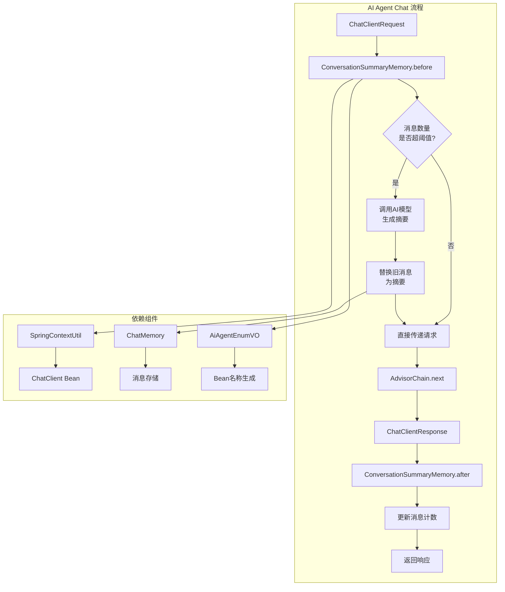
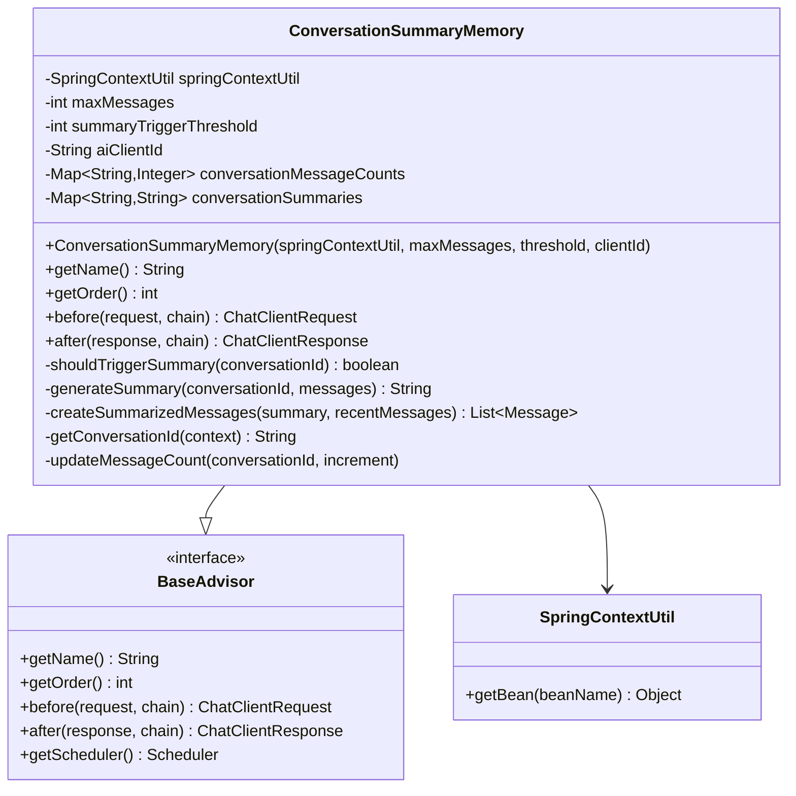
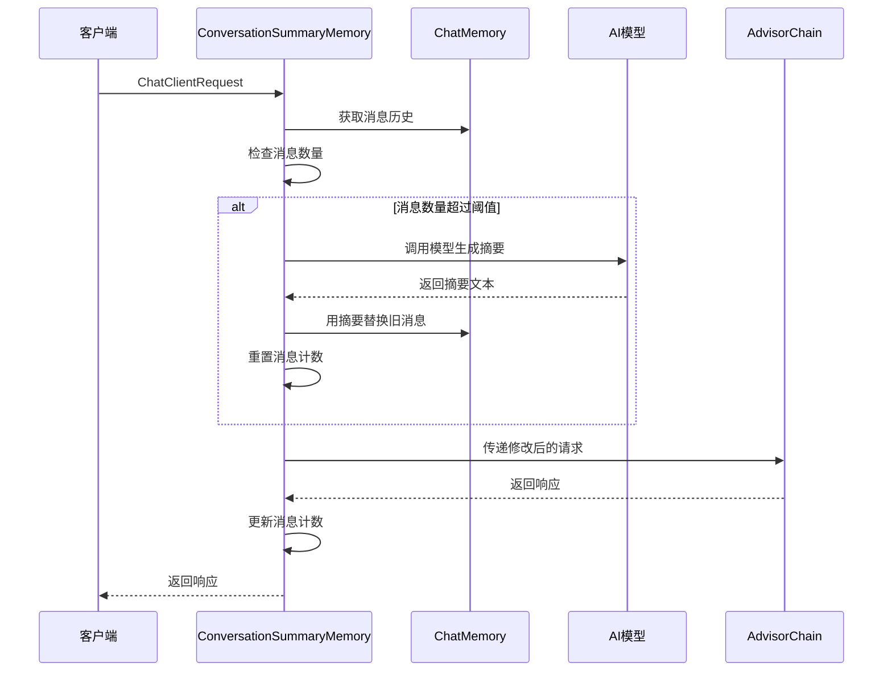
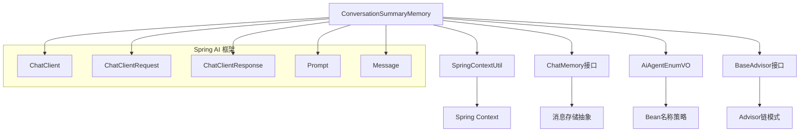
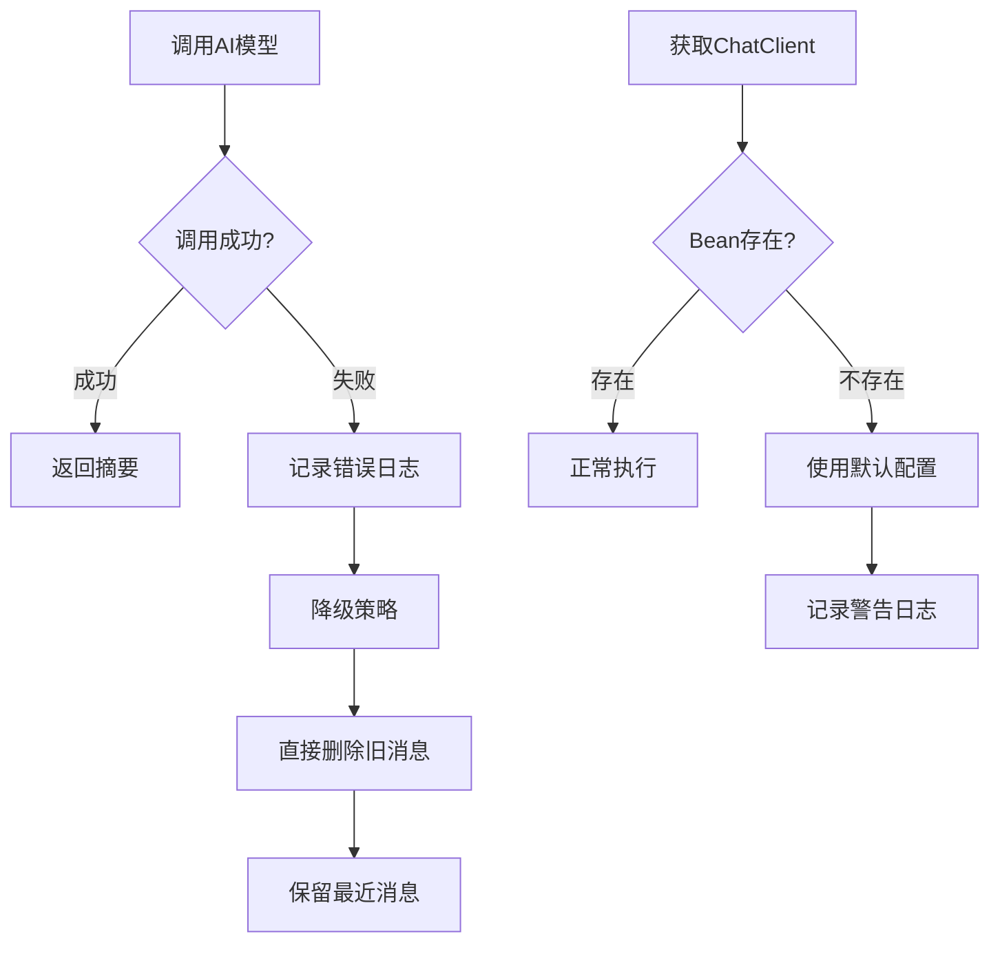

# DESIGN_ConversationSummaryMemory

## 整体架构图



## 分层设计和核心组件

### 1. 核心类设计



### 2. 数据流向图



## 模块依赖关系图



## 接口契约定义

### 1. 构造函数接口
```java
public ConversationSummaryMemory(
    SpringContextUtil springContextUtil,  // Spring上下文工具
    int maxMessages,                       // 最大消息数量
    int summaryTriggerThreshold,          // 触发摘要的阈值
    String aiClientId                     // AI客户端ID
)
```

### 2. 核心方法接口
```java
// 请求前处理
public ChatClientRequest before(ChatClientRequest request, AdvisorChain chain)

// 响应后处理  
public ChatClientResponse after(ChatClientResponse response, AdvisorChain chain)

// 判断是否需要生成摘要
private boolean shouldTriggerSummary(String conversationId)

// 生成对话摘要
private String generateSummary(String conversationId, List<Message> messages)
```

### 3. 配置接口
```java
// 默认配置常量
public static final int DEFAULT_MAX_MESSAGES = 20;
public static final int DEFAULT_SUMMARY_TRIGGER_THRESHOLD = 15;
public static final String DEFAULT_AI_CLIENT_ID = "3002";
```

## 异常处理策略

### 1. 异常类型定义
- `SummaryGenerationException`: 摘要生成失败
- `ConversationNotFoundException`: 会话未找到
- `AIClientNotFoundException`: AI客户端未找到

### 2. 异常处理流程



### 3. 降级机制
1. **AI调用失败**: 直接删除最旧的消息，保持窗口大小
2. **Bean获取失败**: 使用默认AI客户端或跳过摘要功能
3. **摘要生成超时**: 设置5秒超时，超时后采用简单截断策略

## 性能优化设计

### 1. 缓存策略
- **消息计数缓存**: 使用`ConcurrentHashMap`缓存每个会话的消息数量
- **摘要缓存**: 缓存最近生成的摘要，避免重复计算

### 2. 并发处理
- **线程安全**: 使用`ConcurrentHashMap`确保并发访问安全
- **异步处理**: 摘要生成可以采用异步方式，但需要考虑响应时序

### 3. 内存管理
- **定期清理**: 清理长时间不活跃的会话数据
- **大小限制**: 限制单个摘要的最大长度，防止内存溢出

## 配置管理设计

### 1. 配置项定义
```properties
# application.yml 配置示例
aiagent:
  conversation-summary:
    max-messages: 20
    summary-trigger-threshold: 15
    ai-client-id: "3002"
    summary-max-length: 500
    enable-async: false
```

### 2. 配置加载策略
- 优先使用构造函数参数
- 其次使用配置文件
- 最后使用默认值

## 集成接口设计

### 1. 与现有Advisor的集成
- **执行顺序**: 建议在`PromptChatMemoryAdvisor`之前执行
- **数据共享**: 通过`ChatClientRequest.context()`共享数据
- **状态管理**: 独立管理自己的状态，不影响其他Advisor

### 2. 与ChatMemory的集成
- **兼容性**: 与`MessageWindowChatMemory`兼容
- **数据同步**: 确保摘要后的消息能正确同步到ChatMemory
- **事务性**: 保证摘要操作的原子性

## 监控和日志设计

### 1. 关键指标监控
- 摘要触发频率
- 摘要生成耗时
- AI调用成功率
- 内存使用情况

### 2. 日志策略
```java
// 关键操作日志
log.info("触发对话摘要，会话ID: {}, 消息数量: {}", conversationId, messageCount);
log.debug("生成摘要耗时: {}ms", duration);
log.warn("AI调用失败，采用降级策略，会话ID: {}", conversationId);
```