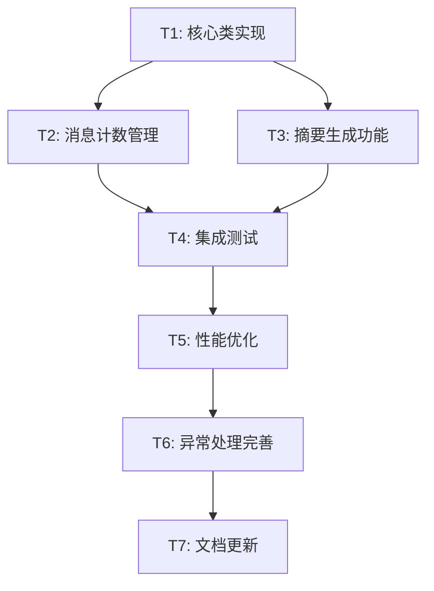

# TASK_ConversationSummaryMemory

## 任务分解与依赖关系

### 任务依赖图

## 原子任务列表

### T1: 核心类实现
**输入契约**:
- 前置依赖: DESIGN文档已完成
- 输入数据: 设计规范、接口定义
- 环境依赖: Spring Boot 3.4.9, Spring AI 1.0.1

**输出契约**:
- 输出数据: 完整的`ConversationSummaryMemory.java`类文件
- 交付物: 实现BaseAdvisor接口的完整类
- 验收标准: 类能够编译通过，包含所有必需方法

**实现约束**:
- 技术栈: 使用Spring AI, Lombok
- 接口规范: 实现BaseAdvisor接口的所有方法
- 质量要求: 代码符合项目编码规范，包含必要注释

**依赖关系**:
- 后置任务: T2, T3
- 并行任务: 无

### T2: 消息计数管理
**输入契约**:
- 前置依赖: T1核心类实现完成
- 输入数据: 基础类结构
- 环境依赖: 核心类已编译

**输出契约**:
- 输出数据: 消息计数相关方法实现
- 交付物: `updateMessageCount`, `shouldTriggerSummary`方法
- 验收标准: 能够正确跟踪和判断消息数量

**实现约束**:
- 技术栈: 使用ConcurrentHashMap保证线程安全
- 接口规范: 提供会话级别的消息计数
- 质量要求: 线程安全，内存使用合理

**依赖关系**:
- 后置任务: T4
- 并行任务: T3

### T3: 摘要生成功能
**输入契约**:
- 前置依赖: T1核心类实现完成
- 输入数据: AI客户端配置，消息列表
- 环境依赖: SpringContextUtil可用

**输出契约**:
- 输出数据: 摘要生成相关方法实现
- 交付物: `generateSummary`, `createSummarizedMessages`方法
- 验收标准: 能够调用AI模型生成有效摘要

**实现约束**:
- 技术栈: 使用Spring AI ChatClient
- 接口规范: 集成AiAgentEnumVO获取Bean
- 质量要求: 异常处理完善，调用稳定

**依赖关系**:
- 后置任务: T4
- 并行任务: T2

### T4: 集成测试
**输入契约**:
- 前置依赖: T2, T3完成
- 输入数据: 完整功能实现
- 环境依赖: 测试环境配置完整

**输出契约**:
- 输出数据: 单元测试和集成测试
- 交付物: 测试类文件，测试报告
- 验收标准: 所有测试用例通过，覆盖率>80%

**实现约束**:
- 技术栈: JUnit 5, Mockito
- 接口规范: 测试before, after方法的各种场景
- 质量要求: 测试用例全面，模拟真实使用场景

**依赖关系**:
- 后置任务: T5
- 并行任务: 无

### T5: 性能优化
**输入契约**:
- 前置依赖: T4集成测试通过
- 输入数据: 性能基准数据
- 环境依赖: 性能测试工具

**输出契约**:
- 输出数据: 优化后的实现
- 交付物: 性能改进代码，性能测试结果
- 验收标准: 响应时间<100ms，内存使用合理

**实现约束**:
- 技术栈: 保持现有技术栈不变
- 接口规范: 不改变对外接口
- 质量要求: 性能提升明显，稳定性不受影响

**依赖关系**:
- 后置任务: T6
- 并行任务: 无

### T6: 异常处理完善
**输入契约**:
- 前置依赖: T5性能优化完成
- 输入数据: 已优化的代码
- 环境依赖: 各种异常场景模拟

**输出契约**:
- 输出数据: 完善的异常处理机制
- 交付物: 异常处理代码，错误恢复机制
- 验收标准: 各种异常场景都有合理处理

**实现约束**:
- 技术栈: 使用Spring的异常处理机制
- 接口规范: 定义自定义异常类型
- 质量要求: 异常信息清晰，恢复机制有效

**依赖关系**:
- 后置任务: T7
- 并行任务: 无

### T7: 文档更新
**输入契约**:
- 前置依赖: T6异常处理完成
- 输入数据: 完整实现代码
- 环境依赖: 文档工具

**输出契约**:
- 输出数据: 更新的项目文档
- 交付物: API文档，使用说明，配置指南
- 验收标准: 文档完整准确，示例可运行

**实现约束**:
- 技术栈: Markdown, JavaDoc
- 接口规范: 符合项目文档规范
- 质量要求: 内容准确，示例完整

**依赖关系**:
- 后置任务: 无
- 并行任务: 无

## 复杂度评估

### 技术复杂度
- **T1: 中等** - 实现标准Advisor接口
- **T2: 简单** - 基础的计数逻辑
- **T3: 高** - AI模型集成和调用
- **T4: 中等** - 全面的测试覆盖
- **T5: 中等** - 性能调优
- **T6: 简单** - 标准异常处理
- **T7: 简单** - 文档编写

### 风险评估
- **高风险**: T3摘要生成功能（AI调用稳定性）
- **中风险**: T4集成测试（环境依赖）
- **低风险**: T1, T2, T5, T6, T7

### 预估工时
- **T1**: 2小时
- **T2**: 1小时  
- **T3**: 3小时
- **T4**: 2小时
- **T5**: 1.5小时
- **T6**: 1小时
- **T7**: 0.5小时
- **总计**: 约11小时

## 质量门控标准

### 代码质量
- [ ] 所有方法都有JavaDoc注释
- [ ] 代码符合Spring Boot编码规范
- [ ] 使用Lombok减少样板代码
- [ ] 异常处理覆盖所有关键路径

### 功能质量  
- [ ] 能够正确监控消息数量
- [ ] 摘要生成功能正常工作
- [ ] 与现有Advisor链兼容
- [ ] 支持流式和非流式响应

### 性能质量
- [ ] 响应时间在可接受范围内
- [ ] 内存使用合理
- [ ] 并发访问安全
- [ ] 资源清理及时

### 测试质量
- [ ] 单元测试覆盖率>80%
- [ ] 集成测试通过
- [ ] 异常场景测试完整
- [ ] 性能测试达标