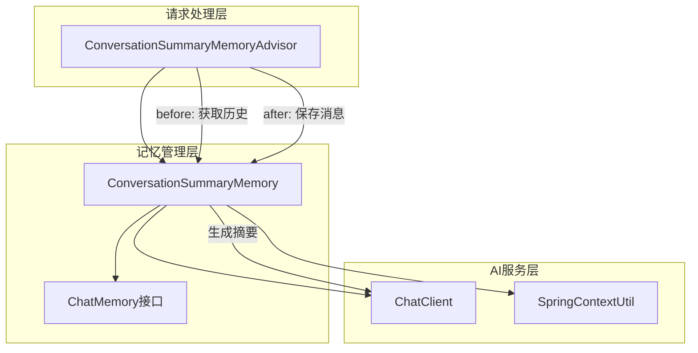

# ConversationSummaryMemory重构任务共识文档

## 明确的需求描述

### 核心需求
将现有的ConversationSummaryMemoryAdvisor重构为两个组件：
1. **ConversationSummaryMemory**: 实现ChatMemory接口，负责智能记忆管理
2. **ConversationSummaryMemoryAdvisor**: 重构为专注于请求处理的Advisor

### 功能需求
1. **记忆管理功能**（迁移到ConversationSummaryMemory）：
   - 对话消息存储和检索
   - 自动摘要生成（当消息数量达到阈值）
   - 对话历史压缩（用摘要替换旧消息）
   - 对话状态管理（消息计数、摘要缓存）
   - 降级策略处理（摘要失败时的回退机制）

2. **请求处理功能**（保留在ConversationSummaryMemoryAdvisor）：
   - before方法：加载历史记录，组合上下文
   - after方法：保存新消息到记忆中
   - 对话ID提取和管理

## 技术实现方案

### 架构设计


### 组件设计

#### ConversationSummaryMemory类
```java
public class ConversationSummaryMemory implements ChatMemory {
    // 配置参数
    private final int summaryTriggerThreshold;
    private final int summaryMaxLength; 
    private final String aiClientId;
    private final Duration summaryTimeout;
    
    // 依赖注入
    private final SpringContextUtil springContextUtil;
    
    // 状态管理（线程安全）
    private final Map<String, List<Message>> conversations = new ConcurrentHashMap<>();
    private final Map<String, Integer> conversationMessageCounts = new ConcurrentHashMap<>();
    private final Map<String, String> conversationSummaries = new ConcurrentHashMap<>();
}
```

#### ConversationSummaryMemoryAdvisor重构
```java
public class ConversationSummaryMemoryAdvisor implements BaseAdvisor {
    private final ConversationSummaryMemory chatMemory;
    private final int order;
    
    // 简化后的before/after方法，专注于请求处理
}
```

### 技术约束
1. **框架兼容性**: 必须与Spring AI 1.0.1框架兼容
2. **线程安全**: 使用ConcurrentHashMap保证并发安全
3. **依赖注入**: 使用现有的SpringContextUtil获取AI客户端
4. **日志规范**: 保持现有的日志格式和级别
5. **异常处理**: 保持现有的异常处理策略

### 集成方案
1. **配置传递**: 通过构造函数将配置参数注入到ConversationSummaryMemory
2. **Bean管理**: ConversationSummaryMemory作为Spring Bean被Advisor依赖
3. **AI客户端访问**: 复用现有的AiAgentEnumVO.AI_CLIENT.getBeanName机制

## 任务边界限制

### 包含范围
✅ 创建完整的ConversationSummaryMemory类
✅ 重构ConversationSummaryMemoryAdvisor类
✅ 迁移所有记忆管理逻辑
✅ 保持现有功能完全兼容
✅ 添加完整的单元测试

### 排除范围
❌ 修改数据库结构
❌ 修改AI客户端配置
❌ 修改Spring配置类
❌ 修改其他Advisor实现
❌ 修改枚举定义

## 验收标准

### 功能验收标准
1. **记忆功能**:
   - [ ] 消息存储和检索正常工作
   - [ ] 摘要生成在达到阈值时自动触发
   - [ ] 对话历史压缩功能正常
   - [ ] 降级策略在摘要失败时正确执行

2. **集成功能**:
   - [ ] Advisor正确加载和使用ConversationSummaryMemory
   - [ ] 请求前历史记录正确组合
   - [ ] 响应后新消息正确保存

3. **性能功能**:
   - [ ] 并发访问安全性验证
   - [ ] 内存使用合理（支持清理机制）
   - [ ] 摘要生成性能符合预期

### 技术验收标准
1. **代码质量**:
   - [ ] 符合现有代码规范和风格
   - [ ] 日志记录完整且格式一致
   - [ ] 异常处理机制完善
   - [ ] 单元测试覆盖率达到80%以上

2. **架构兼容性**:
   - [ ] 实现标准的ChatMemory接口
   - [ ] 与Spring AI框架无缝集成
   - [ ] 不破坏现有的Bean依赖关系

## 风险与缓解策略

### 主要风险
1. **状态迁移风险**: 将状态从Advisor迁移到Memory可能导致状态不一致
   - **缓解**: 谨慎的单元测试和集成测试

2. **配置复杂性**: 配置参数传递可能增加复杂性
   - **缓解**: 使用Builder模式或工厂方法简化配置

3. **性能影响**: 重构可能影响现有性能
   - **缓解**: 保持相同的算法和数据结构

### 质量保证
1. 每个组件独立测试
2. 集成测试验证完整流程
3. 性能基准测试对比
4. 代码审查确保质量

## 交付计划

### 阶段性交付物
1. **Phase 1**: ConversationSummaryMemory核心实现
2. **Phase 2**: ConversationSummaryMemoryAdvisor重构
3. **Phase 3**: 集成测试和验证
4. **Phase 4**: 文档更新和代码优化

### 最终交付物
- 重构后的ConversationSummaryMemory.java
- 重构后的ConversationSummaryMemoryAdvisor.java
- 完整的单元测试套件
- 集成测试验证
- 技术文档更新