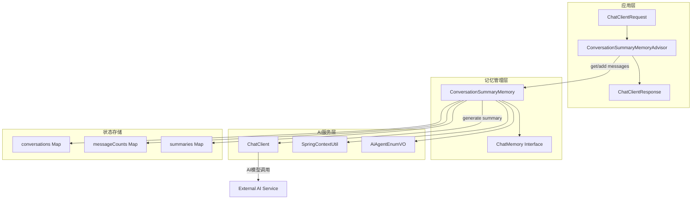
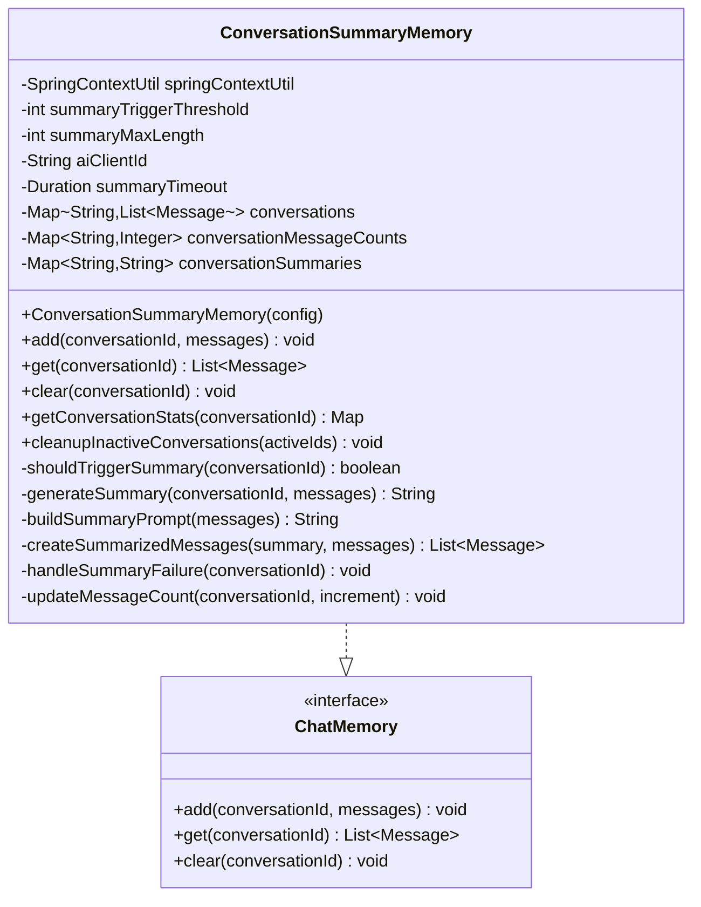
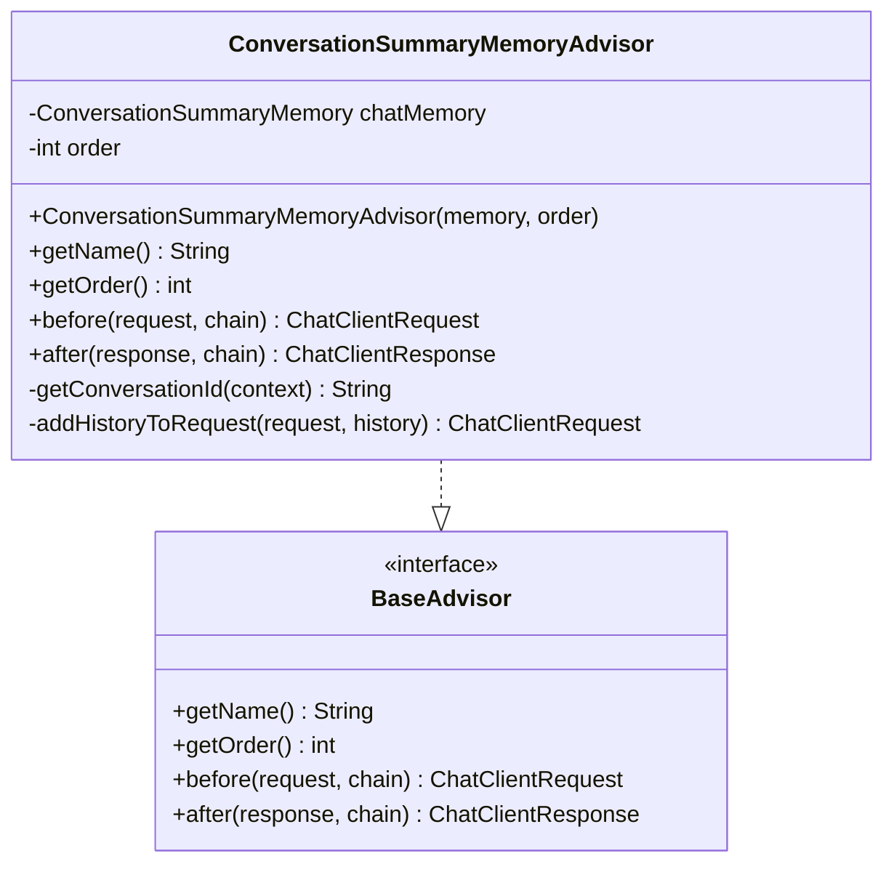
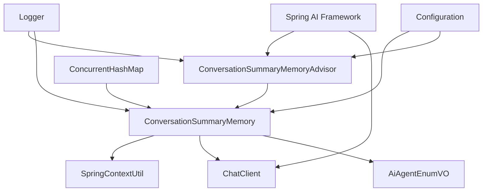
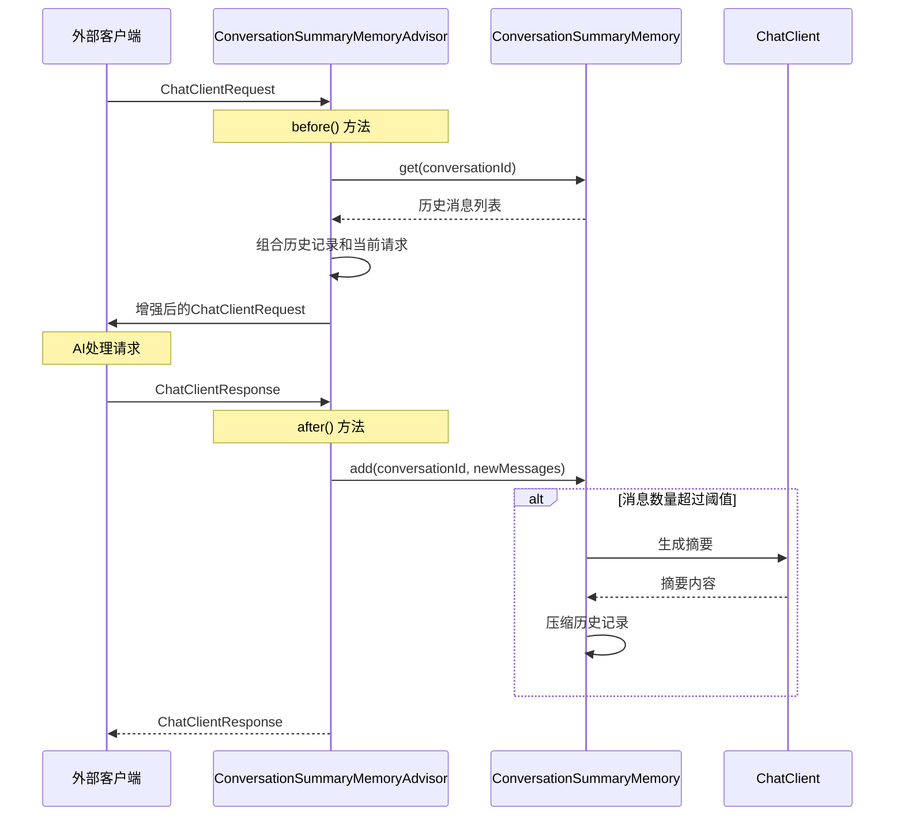
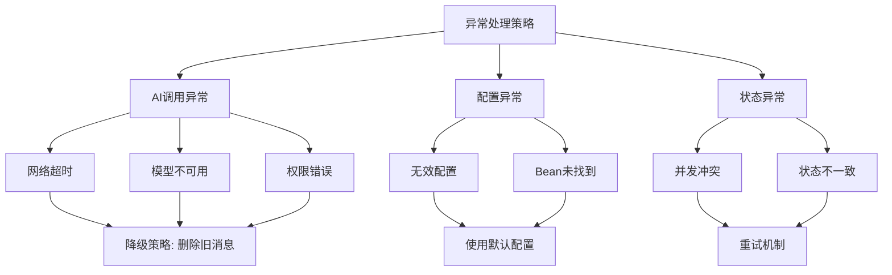

# ConversationSummaryMemory重构架构设计

## 整体架构图



## 分层设计

### 1. 请求处理层 (Advisor Layer)
**职责**: 处理ChatClient的请求和响应流程
- `ConversationSummaryMemoryAdvisor`: 重构后的Advisor，专注于请求处理

### 2. 记忆管理层 (Memory Layer)  
**职责**: 智能记忆管理和对话历史处理
- `ConversationSummaryMemory`: 核心记忆管理组件
- `ChatMemory`: Spring AI标准接口

### 3. AI服务层 (Service Layer)
**职责**: AI模型调用和上下文工具
- `ChatClient`: Spring AI客户端
- `SpringContextUtil`: Bean获取工具
- `AiAgentEnumVO`: 客户端配置枚举

## 核心组件设计

### ConversationSummaryMemory 详细设计



### ConversationSummaryMemoryAdvisor 重构设计



## 接口契约定义

### ConversationSummaryMemory 接口契约

```java
public interface ChatMemory {
    /**
     * 添加消息到对话历史
     * @param conversationId 对话ID
     * @param messages 消息列表
     */
    void add(String conversationId, List<Message> messages);
    
    /**
     * 获取对话历史
     * @param conversationId 对话ID  
     * @return 消息列表
     */
    List<Message> get(String conversationId);
    
    /**
     * 清空对话历史
     * @param conversationId 对话ID
     */
    void clear(String conversationId);
}

// 扩展接口方法
public interface ConversationSummaryMemoryInterface extends ChatMemory {
    /**
     * 获取对话统计信息
     */
    Map<String, Object> getConversationStats(String conversationId);
    
    /**
     * 清理不活跃对话
     */
    void cleanupInactiveConversations(Set<String> activeConversationIds);
}
```

### 构造函数设计

```java
public class ConversationSummaryMemory implements ChatMemory {
    public ConversationSummaryMemory(
        SpringContextUtil springContextUtil,
        int summaryTriggerThreshold,
        int summaryMaxLength,
        String aiClientId,
        Duration summaryTimeout
    );
    
    // 使用默认配置的构造函数
    public ConversationSummaryMemory(SpringContextUtil springContextUtil);
}
```

## 模块依赖关系图



## 数据流向图



## 异常处理策略

### 异常分类和处理



### 降级策略设计

```java
// 摘要生成失败时的降级策略
private void handleSummaryFailure(String conversationId) {
    try {
        List<Message> messages = conversations.get(conversationId);
        if (messages != null && messages.size() > DEFAULT_MAX_MESSAGES) {
            // 保留最近75%的消息
            int keepCount = DEFAULT_MAX_MESSAGES * 3 / 4;
            List<Message> recentMessages = messages.subList(
                Math.max(0, messages.size() - keepCount), 
                messages.size()
            );
            
            conversations.put(conversationId, new ArrayList<>(recentMessages));
            conversationMessageCounts.put(conversationId, recentMessages.size());
            
            log.info("🔄 降级策略执行，保留消息: {}条", recentMessages.size());
        }
    } catch (Exception e) {
        log.error("❌ 降级策略失败", e);
    }
}
```

## 性能优化设计

### 内存管理

1. **ConcurrentHashMap**: 保证线程安全的同时提供良好性能
2. **状态清理**: 提供cleanupInactiveConversations方法防止内存泄漏
3. **摘要缓存**: 缓存生成的摘要，避免重复计算

### 并发控制

```java
// 线程安全的状态更新
private final Map<String, List<Message>> conversations = new ConcurrentHashMap<>();
private final Map<String, Integer> conversationMessageCounts = new ConcurrentHashMap<>();
private final Map<String, String> conversationSummaries = new ConcurrentHashMap<>();

// 原子操作更新计数
private void updateMessageCount(String conversationId, int increment) {
    conversationMessageCounts.merge(conversationId, increment, Integer::sum);
}
```

### 配置优化

```java
// 默认配置常量
public static final int DEFAULT_SUMMARY_TRIGGER_THRESHOLD = 15;
public static final int DEFAULT_SUMMARY_MAX_LENGTH = 500;
public static final String DEFAULT_AI_CLIENT_ID = "3002";
public static final Duration DEFAULT_SUMMARY_TIMEOUT = Duration.ofSeconds(5);
```

## 测试策略

### 单元测试覆盖

1. **ConversationSummaryMemory测试**:
   - 基本CRUD操作测试
   - 摘要生成逻辑测试
   - 降级策略测试
   - 并发安全性测试

2. **ConversationSummaryMemoryAdvisor测试**:
   - before/after方法测试
   - 对话ID提取测试
   - 异常处理测试

### 集成测试设计

```java
@Test
public void testCompleteConversationFlow() {
    // 1. 创建对话
    // 2. 添加消息直到触发摘要
    // 3. 验证摘要生成和历史压缩
    // 4. 验证后续对话正常工作
}
```

## 兼容性保证

### Spring AI 框架兼容

- 实现标准的ChatMemory接口
- 遵循Advisor模式的设计原则
- 保持与现有Bean配置的兼容性

### 现有代码兼容

- 保持相同的日志格式和级别
- 保持相同的异常处理机制
- 保持相同的配置参数体系