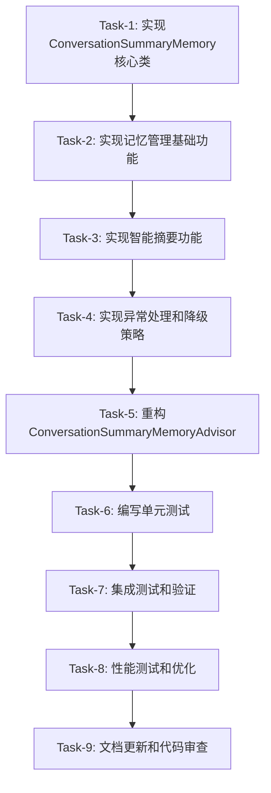

# ConversationSummaryMemory重构任务拆分

## 任务依赖图

## Task-1: 实现ConversationSummaryMemory核心类

### 输入契约
- **前置依赖**: 架构设计文档完成
- **输入数据**: 设计文档中的类结构定义
- **环境依赖**: Java 21, Spring AI 1.0.1, 现有项目依赖

### 输出契约
- **输出数据**: ConversationSummaryMemory.java 基础类框架
- **交付物**: 
  - 类定义和构造函数
  - ChatMemory接口实现的基础结构
  - 配置参数字段定义
  - 状态管理字段定义
- **验收标准**: 
  - 类能够编译通过
  - 实现ChatMemory接口的所有方法（空实现）
  - 包含完整的字段定义和构造函数

### 实现约束
- **技术栈**: Java 21, Spring Framework
- **接口规范**: 必须实现org.springframework.ai.chat.memory.ChatMemory
- **质量要求**: 
  - 使用Lombok注解
  - 包含完整的JavaDoc注释
  - 遵循现有代码风格

### 依赖关系
- **后置任务**: Task-2
- **并行任务**: 无

---

## Task-2: 实现记忆管理基础功能

### 输入契约
- **前置依赖**: Task-1完成
- **输入数据**: ConversationSummaryMemory基础类框架
- **环境依赖**: 现有SpringContextUtil, AiAgentEnumVO

### 输出契约
- **输出数据**: 完整的基础记忆管理功能
- **交付物**:
  - add()方法实现
  - get()方法实现
  - clear()方法实现
  - 基础的消息计数管理
- **验收标准**:
  - 能够正确存储和检索对话消息
  - 线程安全的状态管理
  - 消息计数正确更新

### 实现约束
- **技术栈**: ConcurrentHashMap用于线程安全
- **接口规范**: 完全实现ChatMemory接口语义
- **质量要求**: 
  - 包含详细的日志记录
  - 异常处理基础框架
  - 单元测试可测试性

### 依赖关系
- **前置任务**: Task-1
- **后置任务**: Task-3
- **并行任务**: 无

---

## Task-3: 实现智能摘要功能

### 输入契约
- **前置依赖**: Task-2完成，基础记忆管理功能可用
- **输入数据**: 现有摘要生成逻辑（从ConversationSummaryMemoryAdvisor迁移）
- **环境依赖**: AI客户端访问，SpringContextUtil

### 输出契约
- **输出数据**: 完整的智能摘要功能
- **交付物**:
  - shouldTriggerSummary()方法
  - generateSummary()方法
  - buildSummaryPrompt()方法
  - createSummarizedMessages()方法
  - 摘要缓存管理
- **验收标准**:
  - 在消息数达到阈值时自动触发摘要
  - 成功调用AI客户端生成摘要
  - 正确压缩历史消息
  - 摘要内容缓存正常工作

### 实现约束
- **技术栈**: Spring AI ChatClient
- **接口规范**: 保持与现有摘要逻辑完全一致
- **质量要求**:
  - 超时处理机制
  - 详细的性能日志
  - 摘要长度限制

### 依赖关系
- **前置任务**: Task-2
- **后置任务**: Task-4
- **并行任务**: 无

---

## Task-4: 实现异常处理和降级策略

### 输入契约
- **前置依赖**: Task-3完成，摘要功能基本可用
- **输入数据**: 现有异常处理逻辑
- **环境依赖**: 日志框架，异常处理规范

### 输出契约
- **输出数据**: 完整的异常处理和降级机制
- **交付物**:
  - handleSummaryFailure()方法
  - 全面的异常捕获和处理
  - 降级策略实现
  - 统计信息和清理方法
- **验收标准**:
  - AI调用失败时正确执行降级策略
  - 异常情况下系统保持稳定
  - 提供详细的错误日志和统计信息

### 实现约束
- **技术栈**: 现有日志框架
- **接口规范**: 保持系统健壮性
- **质量要求**:
  - 全面的异常覆盖
  - 优雅的降级处理
  - 防止内存泄漏

### 依赖关系
- **前置任务**: Task-3
- **后置任务**: Task-5
- **并行任务**: 无

---

## Task-5: 重构ConversationSummaryMemoryAdvisor

### 输入契约
- **前置依赖**: Task-4完成，ConversationSummaryMemory功能完整
- **输入数据**: 现有ConversationSummaryMemoryAdvisor代码
- **环境依赖**: Spring AI Advisor框架

### 输出契约
- **输出数据**: 重构后的ConversationSummaryMemoryAdvisor
- **交付物**:
  - 简化的before()方法实现
  - 简化的after()方法实现
  - 依赖ConversationSummaryMemory的构造函数
  - 移除冗余的记忆管理代码
- **验收标准**:
  - Advisor专注于请求处理逻辑
  - 正确使用ConversationSummaryMemory实例
  - 保持与Spring AI框架的兼容性

### 实现约束
- **技术栈**: Spring AI BaseAdvisor
- **接口规范**: 实现BaseAdvisor接口
- **质量要求**:
  - 代码简洁明了
  - 职责单一清晰
  - 保持现有功能不变

### 依赖关系
- **前置任务**: Task-4
- **后置任务**: Task-6
- **并行任务**: 无

---

## Task-6: 编写单元测试

### 输入契约
- **前置依赖**: Task-5完成，所有核心功能实现完毕
- **输入数据**: 完整的ConversationSummaryMemory和重构后的Advisor
- **环境依赖**: JUnit 5, Mockito, Spring Test

### 输出契约
- **输出数据**: 完整的单元测试套件
- **交付物**:
  - ConversationSummaryMemoryTest.java
  - ConversationSummaryMemoryAdvisorTest.java
  - Mock对象和测试数据
  - 测试覆盖率报告
- **验收标准**:
  - 单元测试覆盖率达到80%以上
  - 包含边界条件和异常情况测试
  - 所有测试用例通过

### 实现约束
- **技术栈**: JUnit 5 + Mockito
- **接口规范**: 遵循现有测试规范
- **质量要求**:
  - 测试用例命名清晰
  - 包含完整的测试场景
  - Mock对象使用合理

### 依赖关系
- **前置任务**: Task-5
- **后置任务**: Task-7
- **并行任务**: 无

---

## Task-7: 集成测试和验证

### 输入契约
- **前置依赖**: Task-6完成，单元测试通过
- **输入数据**: 完整的实现和测试套件
- **环境依赖**: Spring Boot测试环境，AI客户端Mock

### 输出契约
- **输出数据**: 完整的集成测试和功能验证
- **交付物**:
  - 端到端集成测试
  - 功能验证测试
  - 兼容性验证测试
  - 测试报告
- **验收标准**:
  - 完整的对话流程正常工作
  - 与现有系统完全兼容
  - 性能符合预期

### 实现约束
- **技术栈**: Spring Boot Test
- **接口规范**: 与现有系统完全兼容
- **质量要求**:
  - 测试场景完整
  - 验证标准明确
  - 问题记录详细

### 依赖关系
- **前置任务**: Task-6
- **后置任务**: Task-8
- **并行任务**: 无

---

## Task-8: 性能测试和优化

### 输入契约
- **前置依赖**: Task-7完成，集成测试通过
- **输入数据**: 性能基准数据
- **环境依赖**: 性能测试工具，监控系统

### 输出契约
- **输出数据**: 性能测试报告和优化建议
- **交付物**:
  - 性能基准测试
  - 并发安全性验证
  - 内存使用分析
  - 性能优化实施
- **验收标准**:
  - 性能不低于现有实现
  - 内存使用合理
  - 并发安全性验证通过

### 实现约束
- **技术栈**: JMH, JProfiler
- **接口规范**: 性能标准符合现有系统
- **质量要求**:
  - 基准测试准确
  - 优化措施有效
  - 文档详细

### 依赖关系
- **前置任务**: Task-7
- **后置任务**: Task-9
- **并行任务**: 无

---

## Task-9: 文档更新和代码审查

### 输入契约
- **前置依赖**: Task-8完成，所有功能和性能验证通过
- **输入数据**: 完整的实现代码和测试
- **环境依赖**: 文档工具，代码审查工具

### 输出契约
- **输出数据**: 最终交付物
- **交付物**:
  - 更新的技术文档
  - 代码审查报告
  - 使用说明文档
  - 迁移指南
- **验收标准**:
  - 文档完整准确
  - 代码质量符合标准
  - 交付物完整

### 实现约束
- **技术栈**: Markdown, 代码审查工具
- **接口规范**: 文档规范标准
- **质量要求**:
  - 文档清晰易懂
  - 代码注释完整
  - 交付标准达标

### 依赖关系
- **前置任务**: Task-8
- **后置任务**: 无
- **并行任务**: 无

## 关键里程碑

### Milestone 1: 核心实现完成 (Task 1-4)
- ConversationSummaryMemory核心功能实现
- 所有记忆管理功能迁移完成
- 智能摘要功能正常工作

### Milestone 2: 重构完成 (Task 5)
- ConversationSummaryMemoryAdvisor重构完成
- 组件职责分离清晰
- 系统架构符合设计

### Milestone 3: 质量保证 (Task 6-8)
- 完整的测试覆盖
- 性能验证通过
- 集成测试通过

### Milestone 4: 交付就绪 (Task 9)
- 文档完整
- 代码审查通过
- 可以正式交付

## 风险控制

### 高风险任务
- **Task-3**: 智能摘要功能 - AI客户端依赖
- **Task-5**: Advisor重构 - 架构变更风险
- **Task-7**: 集成测试 - 兼容性风险

### 缓解措施
- 充分的单元测试覆盖
- 渐进式重构策略
- 详细的兼容性验证

## 资源估算

### 时间估算
- 总计: 约8-10个工作日
- 核心实现(Task 1-4): 4-5天
- 重构和测试(Task 5-7): 3-4天  
- 优化和文档(Task 8-9): 1-2天

### 技能要求
- Java高级开发技能
- Spring AI框架熟悉
- 并发编程经验
- 测试驱动开发经验