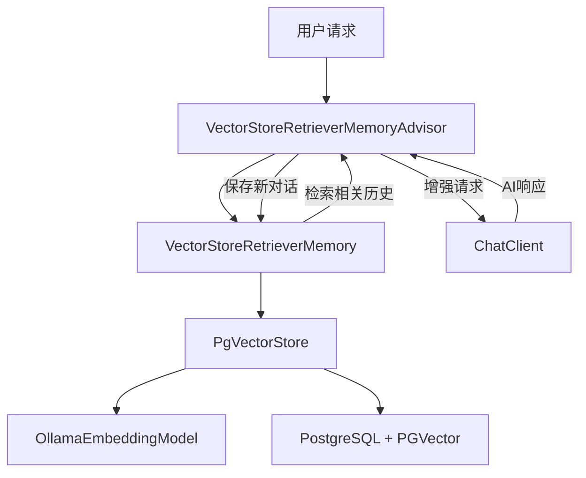

# 向量存储检索记忆功能需求对齐文档

## 项目背景分析

### 现有项目架构理解
- **技术栈**: Spring Boot 3.4.9 + Spring AI 1.0.1 + MyBatis Plus 3.5.5
- **向量数据库**: PGVector (PostgreSQL插件)
- **AI模型**: OpenAI、Ollama（Embedding模型）
- **现有记忆机制**: ConversationSummaryMemory（摘要压缩模式）

### 现有实现模式
1. **ConversationSummaryMemory**: 
   - 实现`ChatMemory`接口，负责记忆管理逻辑
   - 达到阈值时自动AI摘要，保留最近25%消息
   
2. **ConversationSummaryMemoryAdvisor**: 
   - 实现`BaseAdvisor`接口，负责请求/响应拦截
   - before: 增强用户请求（添加历史上下文）
   - after: 保存新对话到记忆管理器

3. **RagAnswerAdvisor**: 
   - 展示了PGVector使用模式
   - 通过VectorStore进行语义相似度搜索
   - 将检索结果注入到请求上下文

## 原始需求
实现VectorStoreRetrieverMemory和VectorStoreRetrieverMemoryAdvisor，其中：
- VectorStoreRetrieverMemory主要负责记忆管理，通过将用户聊天数据存入向量知识库，每次获取的使用会查询于本次相关的内容
- VectorStoreRetrieverMemoryAdvisor负责对聊天内容进行增强，具体实现可以参考ConversationSummaryMemoryAdvisor，pgvector的调用可以参考RagAnswerAdvisor

## 边界确认

### 功能边界
- **VectorStoreRetrieverMemory**: 
  - 存储聊天消息到向量数据库
  - 基于语义相似度检索相关历史消息
  - 不负责UI交互或HTTP响应处理

- **VectorStoreRetrieverMemoryAdvisor**: 
  - 请求前注入相关历史上下文
  - 响应后保存新对话到向量存储
  - 不负责摘要生成或业务逻辑处理

### 技术边界
- 复用现有的`PgVectorStore`和`OllamaEmbeddingModel`配置
- 遵循现有的Spring Bean注册和管理模式
- 继承现有的错误处理和日志记录规范

## 需求理解

### 核心功能需求
1. **向量存储记忆管理**
   - 将用户和AI的对话消息转换为向量并存储
   - 支持conversationId隔离不同会话
   - 基于语义相似度检索相关历史消息

2. **聊天内容增强**
   - 在用户请求前检索相关历史上下文
   - 将历史消息添加到当前请求
   - 在AI响应后保存新对话到向量存储

### 非功能需求
1. **性能要求**
   - 向量检索响应时间 < 1秒
   - 支持并发会话处理
   - 合理的内存使用

2. **可靠性要求**
   - 向量存储失败时的降级策略
   - 异常情况下的日志记录
   - 数据一致性保证

## 疑问澄清

### 已基于项目上下文决策的问题
1. **向量存储格式**: 使用Document格式，包含对话内容和metadata（conversationId、messageType、timestamp）
2. **检索策略**: topK=5，相似度阈值=0.7，避免检索过多不相关内容
3. **消息格式**: 用户消息和AI回复分别作为独立Document存储
4. **集成方式**: 在AiClientAdvisorTypeEnumVO中添加新枚举类型

### 待确认问题
1. **数据生命周期**: 向量数据是否需要定期清理？是否有存储上限？
2. **隐私要求**: 是否需要支持删除特定用户的所有向量数据？
3. **配置参数**: topK、相似度阈值等参数是否需要可配置？

## 技术实现方案

### 架构设计

### 核心组件设计
1. **VectorStoreRetrieverMemory**
   - 实现`ChatMemory`接口
   - 依赖`PgVectorStore`进行向量操作
   - 支持add、get、clear操作

2. **VectorStoreRetrieverMemoryAdvisor** 
   - 实现`BaseAdvisor`接口
   - 复用`ConversationSummaryMemoryAdvisor`的整体结构
   - before: 检索并注入相关历史
   - after: 保存新对话到向量存储

### 技术约束
- 使用现有的Spring AI框架API
- 复用EmbedingModelConfig中的pgVectorStore Bean
- 遵循现有的日志和异常处理模式
- 保持与现有Advisor的一致性

## 集成方案
1. 在`AiClientAdvisorTypeEnumVO`中添加`VECTOR_STORE_RETRIEVER_MEMORY`枚举
2. 创建对应的配置参数类支持topK、相似度阈值等配置
3. 在AiClientAdvisorVO中添加相应的配置字段
4. 确保与现有Advisor的执行顺序兼容

## 验收标准
1. VectorStoreRetrieverMemory能正确存储和检索对话历史
2. VectorStoreRetrieverMemoryAdvisor能正确增强请求和保存响应
3. 与现有系统集成无冲突，支持配置化使用
4. 异常情况下有适当的降级和日志处理
5. 性能满足基本要求（检索时间<1秒）