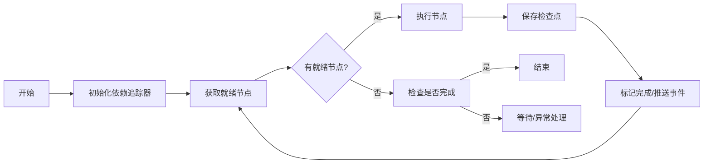

# AI-Agent 工作流编排模块需求文档

## 1. 模块概述

### 1.1 模块名称
工作流编排模块（Orchestration Context）

### 1.2 模块定位
**核心域（Core Domain）** - 平台的核心竞争力所在

### 1.3 核心价值
- 提供 DAG（有向无环图）工作流定义与执行能力
- 支持多种节点类型（LLM、工具、条件分支、人工介入）
- 实现可靠的执行状态管理（暂停/恢复/检查点）
- 提供实时执行状态推送

---

## 2. 功能需求

### 2.1 执行工作流

**功能描述**：根据工作流图定义，调度并执行各个节点。

**业务规则**：
- 解析 WorkflowGraph，构建 DAG 依赖关系
- 按拓扑序调度就绪节点
- 支持节点并行执行（依赖满足时）
- 通过 EventPublisher 推送执行事件
- 每个节点执行完成后保存检查点

**输入参数**：
| 参数 | 类型 | 说明 |
|------|------|------|
| graph | WorkflowGraph | 工作流图定义 |
| conversationId | String | 会话ID |
| listener | WorkflowStateListener | 状态监听器 |
| agentId | String | Agent ID |
| userMessage | String | 用户输入消息 |

**执行流程**：


---

### 2.2 恢复工作流执行

**功能描述**：从暂停点恢复工作流执行，通常在人工审核批准后调用。

**业务规则**：
- 加载检查点恢复执行上下文
- 从指定节点继续执行
- 重新注册状态监听器

**输入参数**：
| 参数 | 类型 | 说明 |
|------|------|------|
| graph | WorkflowGraph | 工作流图定义 |
| conversationId | String | 会话ID |
| fromNodeId | String | 恢复起点节点ID |
| listener | WorkflowStateListener | 状态监听器 |
| agentId | String | Agent ID |

---

### 2.3 取消工作流执行

**功能描述**：取消正在执行的工作流。

**业务规则**：
- 向执行器发送取消信号
- 正在执行的节点尝试中断
- 保存当前状态作为最终检查点
- 推送取消完成事件

**输入参数**：
| 参数 | 类型 | 说明 |
|------|------|------|
| conversationId | String | 会话ID |

---

## 3. 节点类型定义

### 3.1 支持的节点类型

| 类型 | 枚举值 | 描述 | 执行行为 |
|------|--------|------|----------|
| 开始节点 | START | 工作流入口 | 透传输入，触发后续 |
| 结束节点 | END | 工作流出口 | 汇总输出，标记完成 |
| LLM节点 | LLM | 大模型推理 | 调用 LLM API，流式输出 |
| 工具节点 | TOOL | 工具调用 | 执行 MCP 工具 |
| 人工节点 | HUMAN | 人工介入 | 暂停执行，等待审核 |
| 条件节点 | CONDITION | 条件分支 | 评估条件，选择分支 |
| 并行节点 | PARALLEL | 并行执行 | 同时执行多个子流程 |

### 3.2 节点配置结构

```json
{
  "id": "node-001",
  "type": "LLM",
  "name": "智能分析",
  "config": {
    "model": "gpt-4",
    "systemPrompt": "你是一个数据分析专家",
    "userPromptTemplate": "请分析以下数据：{{input}}",
    "temperature": 0.7,
    "maxTokens": 2000
  }
}
```

---

## 4. 状态管理

### 4.1 执行状态枚举

| 状态 | 说明 |
|------|------|
| PENDING | 等待执行 |
| RUNNING | 执行中 |
| PAUSED | 暂停（人工介入） |
| COMPLETED | 执行完成 |
| FAILED | 执行失败 |
| CANCELLED | 已取消 |

### 4.2 执行上下文（ExecutionContext）

```java
ExecutionContext {
    stateData: Map<String, Object>  // 节点间共享状态
    
    // 读取状态
    get(key, type)
    
    // 写入状态（通过 Reducer 合并）
    put(key, value)
    
    // 合并更新
    merge(stateUpdate)
    
    // 创建快照
    snapshot()
    
    // 恢复快照
    restore(data)
}
```

### 4.3 检查点（Checkpoint）

```java
Checkpoint {
    nodeId: String              // 当前节点
    stateSnapshot: Map          // 状态快照
    timestamp: Long             // 时间戳
    executedNodeIds: List       // 已执行节点列表
}
```

---

## 5. 事件发布

### 5.1 领域事件定义

| 事件 | 触发时机 | 数据 |
|------|----------|------|
| ExecutionStartedEvent | 工作流开始 | dagId, conversationId |
| NodeAdvancedEvent | 节点开始执行 | nodeId, nodeName |
| NodeStreamingEvent | 节点流式输出 | nodeId, content |
| NodeCompletedEvent | 节点执行完成 | nodeId, durationMs |
| ExecutionPausedEvent | 工作流暂停 | nodeId, reason |
| ExecutionResumedEvent | 工作流恢复 | nodeId |
| ExecutionCompletedEvent | 工作流完成 | success, message |
| ExecutionFailedEvent | 工作流失败 | errorMessage |

### 5.2 事件发布端口

```java
interface ExecutionEventPublisher {
    void publishNodeStarted(executionId, nodeId, nodeName);
    void publishNodeStreaming(executionId, nodeId, content);
    void publishNodeCompleted(executionId, nodeId, durationMs);
    void publishWorkflowCompleted(executionId, success);
}
```

---

## 6. 非功能需求

### 6.1 可靠性
- 每个节点执行后持久化检查点
- 系统重启后可从检查点恢复
- 节点执行失败支持重试策略

### 6.2 性能
- 节点调度延迟 < 50ms
- 检查点保存延迟 < 100ms
- 单次执行支持 100+ 节点

### 6.3 可扩展性
- 节点类型通过插件机制扩展
- 状态合并策略（Reducer）可配置
- 重试策略可插拔

---

## 7. 领域模型

### 7.1 聚合根：Execution

```java
Execution {
    id: ExecutionId
    agentId: AgentId
    conversationId: ConversationId
    state: ExecutionState
    currentNodeId: String
    context: ExecutionContext
    checkpoints: List<Checkpoint>
    domainEvents: List<DomainEvent>
    
    // 领域行为
    start()
    advanceTo(nodeId)
    pause(reason)
    resume()
    complete(success)
    fail(error)
    cancel()
}
```

### 7.2 领域服务

| 服务 | 职责 |
|------|------|
| SchedulerService | 节点调度执行 |
| RetryPolicy | 重试策略 |
| RouteDecider | 条件路由决策 |
| DependencyTracker | 依赖追踪 |

### 7.3 端口接口

```java
interface CheckpointRepository {
    void save(execution);
    Optional<Execution> load(conversationId);
    void update(execution);
}
```

---

## 8. 依赖关系

### 8.1 对外提供
- IWorkflowService：工作流执行入口
- ExecutionEventPublisher：事件发布能力

### 8.2 依赖外部
- Agent 模块：获取工作流图定义
- Redis：检查点存储
- LLM 服务：大模型推理
- MCP 工具服务：工具执行
